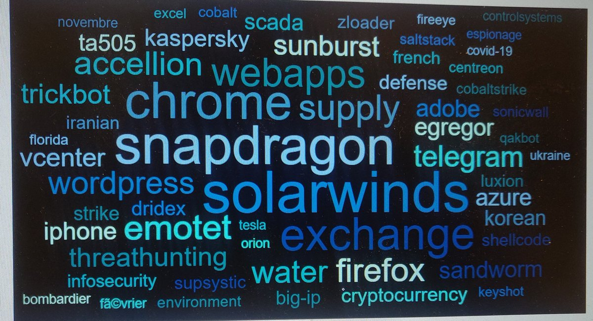
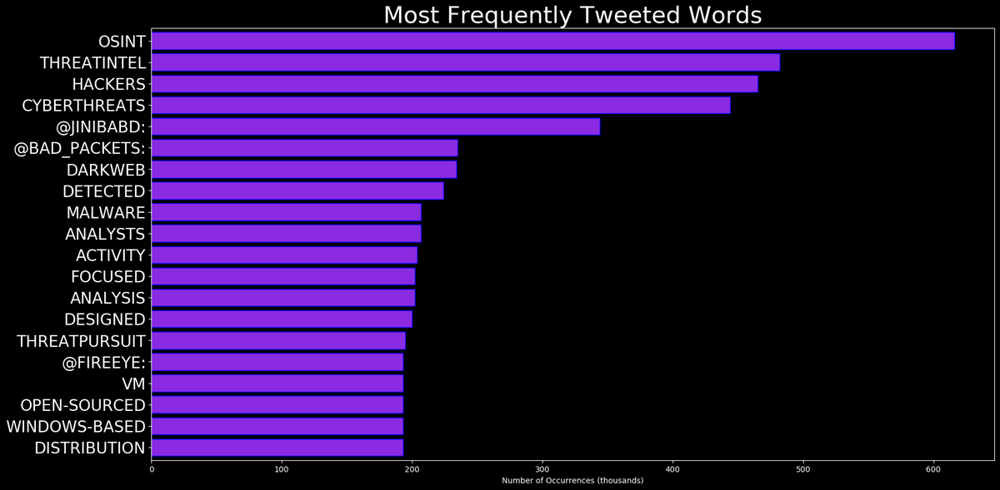
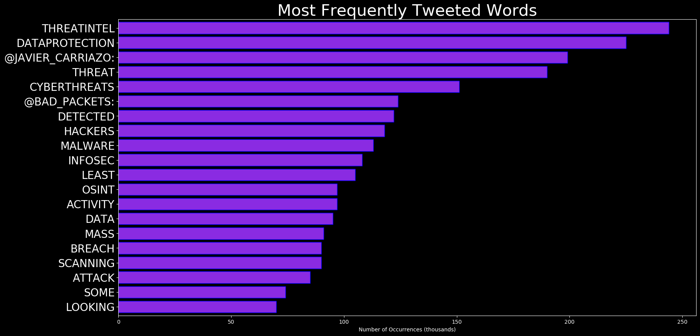
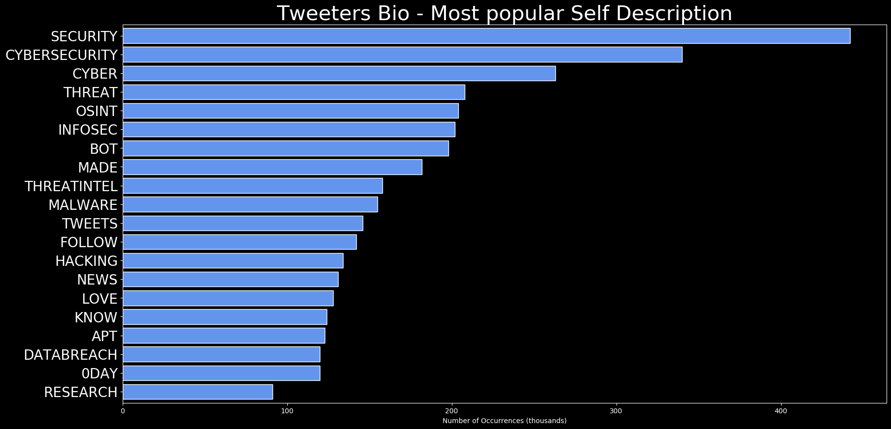
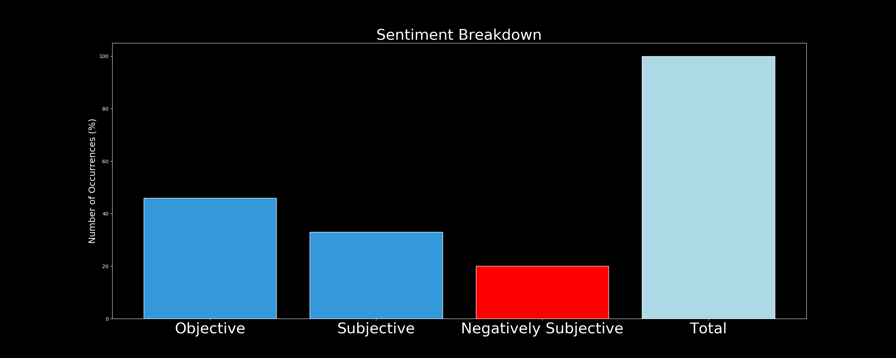

# DARKWIRE SOCIAL CYBER INSIGHTS 
&#x1F34E; **TOPIC = "threatintel"**

## AUTOMATED RESEARCH SUMMARY
     

|  Trending  |   Images | 
:-------------------------:|:-------------------------:
|        |   |   
 
 

  
The most popular user is: **BushidoToken**  
 

## From my experience, a lot of #students studying #Infosec degrees want to either be pentesters or in forensics. Howe… https://t.co/PUh9XkGXms 

  

### TRENDING SHARED IMAGE

|                **Sample-Tweets**        |
| :-------------: |
| RT @bad_packets: Active #DDoS malware payload detected:http://185.172.111.202/bins/Testing.mpsl (https://t.co/CNyfEfqSx7)http://185.172.1… |
| RT @Anomali: New Economic Validation Study by @esg_global estimates a 233% ROI from @Anomali #ThreatIntel Solutions. Anomali customers’ pro… |
| RT @bad_packets: Mass scanning activity detected from 81.17.30.41 (🇨🇭) targeting Palo Alto GlobalProtect VPN endpoints. #threatintel |

## RELATED METRICS 
| Metric | Value |
| ------------- | ------------- |
| #1 Most tweeted to  | **javier_carriazo** |
| #2 Most tweeted to  | **bad_packets** |
| #3 Most tweeted to  | **anthomsec** |
| NewProfiles (less than 10 days) | 0.45%  |
| Tweeters with < 10 followers  | 1.03%|
| Tweeters with > 1000000 followers  | 0.0%  |

## MOST POPULAR TWEET TERMS 

| Popularity Rank  | Term |
| ------------- | ------------- |
| first  | **THREATINTEL**  |
| second  | **DATAPROTECTION**  |
| third  | **@JAVIER_CARRIAZO:** |
| fourth  | **THREAT**  |
| fifth  | **CYBERTHREATS**  |

## Twitter Bio Analysis
### SENTIMENT ANALYSIS

VIEWS WERE : **SUBJECTIVE**  (33.33%) & **NEGATIVELY-SUBJECTIVE** (20.0%) **OBJECTIVE** (46.67%)

### TWEET SAMPLE 
| Random value picked from array |
| ------------- |
|Hackers see opportunity in kids going to school online this fall #cybersecurity #dataprotection #cyberthreats… https://t.co/smD6LKYmcH |

### MOST RETWEETED 

| The most retweeted user is: **BushidoToken**  |
| ------------- |
| From my experience, a lot of #students studying #Infosec degrees want to either be pentesters or in forensics. Howe… https://t.co/PUh9XkGXms |

# Potential Fake Accounts
 
# sentinelleFrUSER INFO

 
`User ScreenName:` sentinelleFr 
 
`User chosen Name:` Sentinelle 
 
`Is the User Verified?:` False 
 
`User signup date?:` Sun Aug 02 14:32:01 +0000 2020 
 
`User Description?:`  
 
`Followers?: `22 
 
`Following?:` 1 
 
`User URL?:` None 
 
`Location:`  
 
`Number of tweets extracted`  : 200 
 
`Profile image:` http://pbs.twimg.com/profile_images/1289947708971724810/Xo7Zm8Og_normal.jpg 
 
`Number of tweets excluding replies:` 1185 
 

 

 
## User Top tweeted words 
 
**HACKING** 43 , **CYBERSECURITY** 40 , **INFOSEC** 26 , **SECURITY** 23 , **LINUX** 20 , **NEW** 15 , **HACKERS** 14 , **TWITTER** 12 , **IOT** 12 , **DATA** 11 , **OSINT** 10 , **PRIVACY** 10 , **OPENSOURCE** 9 , **CYBER** 8 , **2020** 8 , **RANSOMWARE** 8 , **@NCSVENTURES:** 8 , **PROGRAMMING** 8 , **@0FORTUNEBOT:** 8 , **&GT;** 8 , 
 
## What this user tweeted
 
RT @RedPacketSec: DeimosC2 - A Golang Command And Control Framework For Post-Exploitation - https://t.co/TWniVYndJF
#Hacking #OSINT #Securi…RT @ashokkrishna99: #DeepWeb #OSINT #Fraud #InfoSec #ThreatIntel #Cyber #Security #NetSec #CyberSecurity #CyberCrime   #DarkWeb #onion #Tor…RT @ScanTitan: Download Vulnerability Digest July 2020 report that shows the top 10 trends on security vulnerabilities and how hackers are…RT @BushidoToken: From my experience, a lot of #students studying #Infosec degrees want to either be pentesters or in forensics. However, I…
 
# ThatOsintPersonUSER INFO

 
`User ScreenName:` ThatOsintPerson 
 
`User chosen Name:` That OSINT Person 
 
`Is the User Verified?:` False 
 
`User signup date?:` Wed Jul 29 11:03:34 +0000 2020 
 
`User Description?:` That OSINT Person/ CTI analyst 
 
`Followers?: `4 
 
`Following?:` 28 
 
`User URL?:` None 
 
`Location:`  
 
`Number of tweets extracted`  : 8 
 
`Profile image:` http://pbs.twimg.com/profile_images/1289086723801178112/CsF24cvj_normal.jpg 
 
`Number of tweets excluding replies:` 8 
 

 

 
## User Top tweeted words 
 
**ICANN** 2 , **DOMAINS** 2 , **PLUGIN** 2 , **GUESS** 1 , **EURID** 1 , **DENIC** 1 , **HAVING** 1 , **BAD** 1 , **WEEKEND** 1 , **HTTPS://TCO/MPKNNAGCWW** 1 , **THREATINTELLIGENCE100+** 1 , **NEW** 1 , **XYZ** 1 , **DGA** 1 , **NAMES** 1 , **LISTED** 1 , **OTX** 1 , **MALWARE** 1 , **HTTPS://TCO/FJHLLXYEPZCHANCES** 1 , **DISCOVERING** 1 , 
 
## What this user tweeted
 
@pulsedive has a great free browser plugin(s) for threat analysis (yes those are dodgy domains in the screenshot).… https://t.co/XCMn6G7MIL
 
# Or1g1nRUSER INFO

 
`User ScreenName:` Or1g1nR 
 
`User chosen Name:` Or1g1n.r3 
 
`Is the User Verified?:` False 
 
`User signup date?:` Tue Jul 28 19:19:36 +0000 2020 
 
`User Description?:` A home for Reverse Engineers , Malware Authors , Analysts and Game Hacking enthusiasts . 
 
`Followers?: `1 
 
`Following?:` 45 
 
`User URL?:` https://t.co/gXy8smM9Eo 
 
`Location:` 0xfffffff 
 
`Number of tweets extracted`  : 18 
 
`Profile image:` http://pbs.twimg.com/profile_images/1288199466881708032/CVBW4gLt_normal.jpg 
 
`Number of tweets excluding replies:` 18 
 

 

 
## User Top tweeted words 
 
**MALWARE** 4 , **ANALYSIS** 3 , **EMAIL** 3 , **USING** 2 , **INTO** 2 , **REVERSE** 2 , **ENGINEERING** 2 , **GOOD** 2 , **@CRYPTOLAEMUS1:** 2 , **EMOTET** 2 , **EPOCH** 2 , **1** 2 , **PUBLISHED** 2 , **SOME** 2 , **NEW** 2 , **FIRST** 2 , **PE** 2 , **MODULE** 2 , **BLOCKS** 2 , **RT** 1 , 
 
## What this user tweeted
 
RT @bryceabdo: Recent interesting #CobaltStrike infra &amp; loaders:

192.169.6.175 &amp; 169.239.128.55
🔐 SSL CN: signup.africavolunteeringforum[.…
 
# Cyberklki1USER INFO

 
`User ScreenName:` Cyberklki1 
 
`User chosen Name:` Cyberk@lki 
 
`Is the User Verified?:` False 
 
`User signup date?:` Sun Jul 26 17:28:07 +0000 2020 
 
`User Description?:` Security Researcher ||  Joker fan 
Offensive Security | OSINT |
Malware Analyst | DevSecOps | Incident Response | IOT & OT Security
Favourite TP - Hacking PAK 
 
`Followers?: `8 
 
`Following?:` 54 
 
`User URL?:` https://t.co/y8crG4Yz3U 
 
`Location:`  
 
`Number of tweets extracted`  : 35 
 
`Profile image:` http://pbs.twimg.com/profile_images/1287439653461614592/mxXscC02_normal.jpg 
 
`Number of tweets excluding replies:` 35 
 

 

 
## User Top tweeted words 
 
**U** 9 , **OSINT** 8 , **UR** 4 , **HELP** 3 , **BRO** 2 , **FEW** 2 , **TOOL** 2 , **CYBERSECURITY** 2 , **IDIOTS** 2 , **BOLLYWOOD** 2 , **@SPRP77:** 2 , **WEBCAM** 2 , **HACKING** 2 , **2** 2 , **TWITTER** 2 , **!!** 2 , **EASY** 2 , **INFOSEC** 2 , **SEARCH** 2 , **USERNAME** 2 , 
 
## What this user tweeted
 
Learn about OSINT tricks, tactics &amp; techniques !!!
Follow my blog https://t.co/Bt5klzrUBC

#OSINT #Pentest #Cybersecurity #ThreatIntel
 

<b> This report is AUTOMATED and not hand crafted, it is designed for pulling metrics on a given keyword or hashtag and performs a series of reporting and analysis.</b>  
### CONCLUSION & EXTERNAL ANALYSIS

*This is my [Adam McMurchie`s] opinion on the data from the tweets, it serves as no objective truth.Since the tweets themselves are a mixture of fact & opinion. 
Authors analytical summary on request.
**RECOMMENDATIONS** WILL BE UPDATED IN NEXT  24 HOURS  
 
`Number of tweets excluding replies:` 170 
 

 

 
## User Top tweeted words 
 
**100DAYSOFCODE** 29 , **INFOSEC** 18 , **JAVASCRIPT** 18 , **PROGRAMMING** 18 , **DAY** 14 , **HACKING** 10 , **POWERSPLOIT** 8 , **SECURITY** 8 , **CODE** 7 , **REACT** 6 , **DATA** 6 , **BEST** 5 , **POWERSHELL** 5 , **CODING** 5 , **CSS** 5 , **CHECK** 5 , **FREE** 5 , **BETTER** 5 , **DEVELOPER** 5 , **GITHUB** 5 , 
 
## What this user tweeted
 
RT @DarkReading: Software vendors provide #healthcare organizations with data delivery, processing, and storage solutions critical to deliv…dazzleUP - A Tool That Detects The Privilege Escalation Vulnerabilities Caused By Misconfigurations And Missing Upd… https://t.co/MK47o5JbaPTsunami is a general purpose network security scanner with an extensible plugin system for detecting high severity… https://t.co/ZnOqn9ECbo
 
# levitateduasUSER INFO

 
`User ScreenName:` levitateduas 
 
`User chosen Name:` Levitateagain (Duas) 
 
`Is the User Verified?:` False 
 
`User signup date?:` Sun Aug 02 15:16:50 +0000 2020 
 
`User Description?:` FB. backup for @levitateagain, I love all female artists except few. Gaga, Dua, Nicki are and will always be the loves of my life. I love bts, ari, Katy,ava too 
 
`Followers?: `216 
 
`Following?:` 382 
 
`User URL?:` None 
 
`Location:` I'm Obsessed 
 
`Number of tweets extracted`  : 32 
 
`Profile image:` http://pbs.twimg.com/profile_images/1290019087993593856/B_uA5huy_normal.jpg 
 
`Number of tweets excluding replies:` 33 
 

 

 
## User Top tweeted words 
 
**@LEVITATEAGAIN** 9 , **FOLLOW** 5 , **OMG** 4 , **@IAMCARDIB** 4 , **@LEVITATEAGAIN:** 3 , **LIKES** 3 , **@DONTTBLAMEME** 3 , **RT** 2 , **DUA** 2 , **LIPA** 2 , **YES** 2 , **NUMBER** 2 , **1** 2 , **BACK** 2 , **PLEASE** 2 , **RETWEET** 2 , **FIND** 2 , **MUTUALS🥺😭** 2 , **HTTPS://TCO/MG1XC6R4KNRT** 2 , **@GAINSARIFANSSS:** 2 , 
 
## What this user tweeted
 
RT @barbz_hotline: When will we realise that our socially constructed toxic hegemonic masculinity &amp; gender roles are taking away the lives…
 
# j_pollssUSER INFO

 
`User ScreenName:` j_pollss 
 
`User chosen Name:` j.pollss 
 
`Is the User Verified?:` False 
 
`User signup date?:` Wed Jul 29 21:16:37 +0000 2020 
 
`User Description?:` free soul 🥀 
 
`Followers?: `0 
 
`Following?:` 18 
 
`User URL?:` None 
 
`Location:`  
 
`Number of tweets extracted`  : 34 
 
`Profile image:` http://pbs.twimg.com/profile_images/1288584412293103623/6dRqnEHG_normal.jpg 
 
`Number of tweets excluding replies:` 35 
 

 

 
## User Top tweeted words 
 
**SOMEONE** 4 , **SURE** 3 , **@WILLPREMO:** 3 , **PEOPLE** 3 , **FEEL** 3 , **EVER** 3 , **I’M** 3 , **NEVER** 3 , **@FISAYOLONGE:** 2 , **MAKE** 2 , **LIFE** 2 , **BEFORE** 2 , **THING** 2 , **MEN** 2 , **MAN** 2 , **LOVE** 2 , **CARE** 2 , **PLEASE** 2 , **THATS** 2 , **OKAY** 2 , 
 
## What this user tweeted
 
RT @dbcxptures: I pray you find someone you can bare your soul with, someone who will protect your vulnerabilities without fear of it being…
 
# _harshitaaaaUSER INFO

 
`User ScreenName:` _harshitaaaa 
 
`User chosen Name:` HARdoesntgiveashitA 
 
`Is the User Verified?:` False 
 
`User signup date?:` Tue Jul 28 13:03:58 +0000 2020 
 
`User Description?:` 16 || Just another teenager with a dream to get WANDERLUST tattooed but also has no energy to even get up and go for a walk ●︿● 
 
`Followers?: `5 
 
`Following?:` 49 
 
`User URL?:` None 
 
`Location:`  
 
`Number of tweets extracted`  : 32 
 
`Profile image:` http://pbs.twimg.com/profile_images/1289186474475180032/oAM_4iOi_normal.jpg 
 
`Number of tweets excluding replies:` 32 
 

 

 
## User Top tweeted words 
 
**GONNA** 4 , **STAY** 3 , **RAHA** 3 , **BHI** 3 , **TWITTER** 2 , **HAI** 2 , **REMINDER** 2 , **FAMILY** 2 , **FRIENDS** 2 , **YOURSELF** 2 , **LOVE** 2 , **SOME** 2 , **PERSONAL** 2 , **!!!** 2 , **WORLD** 2 , **JO** 2 , **DEKH** 2 , **MARR** 2 , **TWEET** 2 , **LOOK** 2 , 
 
## What this user tweeted
 
RT @ladywithflaws: A harsh reminder - Do not open up to people except your family, your partner and your closest friends. Most of the peopl…
 
# sabeeisUSER INFO

 
`User ScreenName:` sabeeis 
 
`User chosen Name:` sabee 
 
`Is the User Verified?:` False 
 
`User signup date?:` Sun Aug 02 12:51:14 +0000 2020 
 
`User Description?:` Mess but who cares|| feminist|| learning and loving the book reading phase of life|| deeply into learning food culture 
 
`Followers?: `2 
 
`Following?:` 24 
 
`User URL?:` None 
 
`Location:` Nepal 
 
`Number of tweets extracted`  : 10 
 
`Profile image:` http://pbs.twimg.com/profile_images/1290234959148417027/Uu7a9ZPy_normal.jpg 
 
`Number of tweets excluding replies:` 10 
 

 

 
## User Top tweeted words 
 
**DON’T** 3 , **PEOPLE** 2 , **PAPAYA** 2 , **LEG** 2 , **SAY** 2 , **NEVER** 1 , **TESTED** 1 , **LOCAL** 1 , **HYBRID** 1 , **TASTELESS** 1 , **🤦🏻‍♀️SO** 1 , **WATCH** 1 , **PRETTY** 1 , **FULL** 1 , **MOON** 1 , **😊OMG** 1 , **LOOK** 1 , **US** 1 , **AUDACITY** 1 , **LIVE** 1 , 
 
## What this user tweeted
 
You don’t have to be brave always let’s embrace vulnerabilities too
 
# inc_spokenUSER INFO

 
`User ScreenName:` inc_spoken 
 
`User chosen Name:` Spoken Truth Inc.© 
 
`Is the User Verified?:` False 
 
`User signup date?:` Sat Jul 25 13:12:47 +0000 2020 
 
`User Description?:` Writings. Quotes. Wisdom. Music. Inspiration. Life, love, and current events. ❤🌍❤ #writingcommunity #writerscafe 
Suicide Prevention Hotline-1-800-273-8255 
 
`Followers?: `216 
 
`Following?:` 249 
 
`User URL?:` None 
 
`Location:`  
 
`Number of tweets extracted`  : 200 
 
`Profile image:` http://pbs.twimg.com/profile_images/1287532465247133696/DpNYxlNM_normal.jpg 
 
`Number of tweets excluding replies:` 958 
 

 

 
## User Top tweeted words 
 
**U** 31 , **I'M** 15 , **LOVE** 14 , **MORNING** 13 , **GOOD** 12 , **THANK** 12 , **@DOLLYD2271** 12 , **@CLOUISLUNA** 11 , **BLESSINGS** 10 , **HAHA** 10 , **BROTHER** 9 , **LOL** 9 , **DAY** 9 , **PEOPLE** 8 , **YOU'RE** 8 , **DEAR** 8 , **TOO** 7 , **TIME** 7 , **ALWAYS** 7 , **TRYING** 6 , 
 
## What this user tweeted
 
@ashmonster1988 No, thank you , for expressing yourself.  Our vulnerabilities is also our strengths.  The pleasure… https://t.co/JtN2JT8P15
 
# megs_is_livingUSER INFO

 
`User ScreenName:` megs_is_living 
 
`User chosen Name:` Meg 
 
`Is the User Verified?:` False 
 
`User signup date?:` Sun Aug 02 14:58:02 +0000 2020 
 
`User Description?:` 20 // inpatient // learning to live my best life✨ 
 
`Followers?: `15 
 
`Following?:` 18 
 
`User URL?:` None 
 
`Location:` Northampton, England 
 
`Number of tweets extracted`  : 24 
 
`Profile image:` http://pbs.twimg.com/profile_images/1289938773527191552/0jqNDcch_normal.jpg 
 
`Number of tweets excluding replies:` 24 
 

 

 
## User Top tweeted words 
 
**THEN** 4 , **LOVE** 4 , **REALLY** 3 , **I’M** 2 , **WORKING** 2 , **HARD** 2 , **MAKES** 2 , **TIME** 2 , **GOING** 2 , **BEFORE** 2 , **QUICKLY** 2 , **DUE** 2 , **ALWAYS** 2 , **DONT** 1 , **EAT** 1 , **VEGGIE** 1 , **CRISPS** 1 , **RING** 1 , **LUCOZADE** 1 , **SPORTIT** 1 , 
 
## What this user tweeted
 
My risk increased very quickly due to a list of vulnerabilities at the moment in time and was swiftly discharged (t… https://t.co/vUDqQgQDxh
 
# SophieArgyresUSER INFO

 
`User ScreenName:` SophieArgyres 
 
`User chosen Name:` Sophie Argyres 
 
`Is the User Verified?:` False 
 
`User signup date?:` Sat Aug 01 18:35:50 +0000 2020 
 
`User Description?:` Creating a blog about my mental health journey and finding self love along the way! Follow me up for updates on the blog: https://t.co/XSTBBKDev7 
 
`Followers?: `0 
 
`Following?:` 0 
 
`User URL?:` None 
 
`Location:`  
 
`Number of tweets extracted`  : 8 
 
`Profile image:` http://pbs.twimg.com/profile_images/1289631005695934464/Za5wEIT3_normal.jpg 
 
`Number of tweets excluding replies:` 8 
 

 

 
## User Top tweeted words 
 
**ATTACHED** 4 , **THING** 3 , **BEST** 2 , **DON'T** 2 , **READ** 2 , **FINDING** 1 , **JOB** 1 , **WORKS** 1 , **FAVOR** 1 , **MENTAL** 1 , **HEALTH** 1 , **COMES** 1 , **DOWN** 1 , **WORD:** 1 , **INTENTION** 1 , **NEED** 1 , **ELABORATE?** 1 , **A…** 1 , **HTTPS://TCO/GWKGH9DG1HWHEN** 1 , **MOVING** 1 , 
 
## What this user tweeted
 
Seeking support from others doesn't make you weak. It is the strongest thing you can do! Read my first blog post on… https://t.co/tYcFfTb1rq
 
# Tear_of_PhoenixUSER INFO

 
`User ScreenName:` Tear_of_Phoenix 
 
`User chosen Name:` Kushal Paul 
 
`Is the User Verified?:` False 
 
`User signup date?:` Fri Jul 31 20:08:41 +0000 2020 
 
`User Description?:` A believer in Diversity, Empathy, Generosity. 
Life coach. Therapist. Hypnotherapist.
Indie Filmmaker. Designer. Developer. 
 
`Followers?: `5 
 
`Following?:` 19 
 
`User URL?:` https://t.co/6QmsrbRBi6 
 
`Location:`  
 
`Number of tweets extracted`  : 25 
 
`Profile image:` http://pbs.twimg.com/profile_images/1289292042208649216/l9oUQtXu_normal.jpg 
 
`Number of tweets excluding replies:` 25 
 

 

 
## User Top tweeted words 
 
**MINDSET** 5 , **LIFECOACH** 3 , **LOVE** 3 , **SUNDAYVIBES** 3 , **SUNDAYTHOUGHTS** 3 , **MONDAYMOTIVATION** 2 , **VERY** 2 , **LIFE** 2 , **NEVER** 2 , **US** 2 , **HAPPYFRIENDSHIPDAY2020** 2 , **FALL** 2 , **KEEPS** 2 , **EMPATHY** 2 , **ALIVE** 2 , **'COCKROACHES'** 1 , **MEANT!** 1 , **@DEVDUTTMYTH** 1 , **HTTPS://TCO/QC11AC6CATMINDFULNESS** 1 , **PERSPECTIVE** 1 , 
 
## What this user tweeted
 
RT @TheDeshBhakt: Dr Aisha and her twitter account are no longer with us.
However, even in death, she left us with a very important lesson.…
 
# Dinesh01451USER INFO

 
`User ScreenName:` Dinesh01451 
 
`User chosen Name:` Dinesh0145 
 
`Is the User Verified?:` False 
 
`User signup date?:` Sun Jul 26 14:12:47 +0000 2020 
 
`User Description?:`  
 
`Followers?: `5 
 
`Following?:` 26 
 
`User URL?:` None 
 
`Location:`  
 
`Number of tweets extracted`  : 68 
 
`Profile image:` http://abs.twimg.com/sticky/default_profile_images/default_profile_normal.png 
 
`Number of tweets excluding replies:` 69 
 

 

 
## User Top tweeted words 
 
**में** 26 , **की** 19 , **के** 19 , **और** 14 , **को** 13 , **तो** 13 , **है** 12 , **का** 11 , **@ROFLGANDHI_:** 10 , **पर** 10 , **हो** 9 , **से** 9 , **ये** 8 , **भी** 8 , **हैं** 7 , **@JYOTIYADAAV:** 6 , **नहीं** 6 , **@ROHINI_SGH:** 5 , **@SJOSEPHBURNS:** 5 , **MAN** 5 , 
 
## What this user tweeted
 
RT @TheDeshBhakt: Dr Aisha and her twitter account are no longer with us.
However, even in death, she left us with a very important lesson.…
 
# SDGirl91USER INFO

 
`User ScreenName:` SDGirl91 
 
`User chosen Name:` Nothing Special 💜 
 
`Is the User Verified?:` False 
 
`User signup date?:` Fri Jul 31 01:08:30 +0000 2020 
 
`User Description?:` I'm only here to avoid my kids and to have some fun 🍻 ⚽️ 🎵 sarcastic AF 
No DM's 🚫 
 
`Followers?: `38 
 
`Following?:` 36 
 
`User URL?:` None 
 
`Location:`  
 
`Number of tweets extracted`  : 142 
 
`Profile image:` http://pbs.twimg.com/profile_images/1289023229969997824/67lrIsoy_normal.jpg 
 
`Number of tweets excluding replies:` 142 
 

 

 
## User Top tweeted words 
 
**I'M** 13 , **SOMEONE** 7 , **LOVE** 7 , **NEVER** 6 , **I'LL** 6 , **GOOD** 6 , **DRINKING** 5 , **MISS** 5 , **FUCK** 5 , **ALWAYS** 5 , **TRYING** 5 , **@LOSTSOU38371630:** 5 , **DRINK** 5 , **EVEN** 4 , **SEEN** 4 , **DON'T** 4 , **MAKE** 4 , **NEED** 4 , **YES** 4 , **THAN** 4 , 
 
## What this user tweeted
 
RT @SexytotheNorth: Find someone who you don’t have to pretend with and isn’t afraid to share their messy vulnerabilities with you.
 
# bHad__assUSER INFO

 
`User ScreenName:` bHad__ass 
 
`User chosen Name:` bHad_ass 
 
`Is the User Verified?:` False 
 
`User signup date?:` Fri Jul 31 16:08:04 +0000 2020 
 
`User Description?:` Clueless. Hopeless. Procrastinator. Potato. 
 
`Followers?: `0 
 
`Following?:` 21 
 
`User URL?:` None 
 
`Location:`  
 
`Number of tweets extracted`  : 28 
 
`Profile image:` http://pbs.twimg.com/profile_images/1289236442586087424/ZQOPeV33_normal.jpg 
 
`Number of tweets excluding replies:` 28 
 

 

 
## User Top tweeted words 
 
**LONGER** 3 , **SHAH** 3 , **2** 3 , **HOME** 3 , **DAY** 3 , **WIKIPEDIA** 3 , **INDIAN** 3 , **ITS** 3 , **NEXT** 2 , **YEAR** 2 , **LAST** 2 , **❤️** 2 , **GOVT** 2 , **SUSHANT** 2 , **SINGH** 2 , **@SRIVATSAYB:** 2 , **BHAKTS** 2 , **MINISTER** 2 , **PRIVATE** 2 , **HOSPITAL** 2 , 
 
## What this user tweeted
 
RT @TheDeshBhakt: Dr Aisha and her twitter account are no longer with us.
However, even in death, she left us with a very important lesson.…
 
# _Prachi_patelUSER INFO

 
`User ScreenName:` _Prachi_patel 
 
`User chosen Name:` Prachi Patel 
 
`Is the User Verified?:` False 
 
`User signup date?:` Wed Jul 29 14:48:44 +0000 2020 
 
`User Description?:`  
 
`Followers?: `0 
 
`Following?:` 71 
 
`User URL?:` None 
 
`Location:`  
 
`Number of tweets extracted`  : 14 
 
`Profile image:` http://abs.twimg.com/sticky/default_profile_images/default_profile_normal.png 
 
`Number of tweets excluding replies:` 14 
 

 

 
## User Top tweeted words 
 
**बने** 3 , **एक** 2 , **US** 2 , **DEATH** 2 , **वो** 2 , **का** 2 , **@SARDESAIRAJDEEP:** 2 , **DELHI** 2 , **REDUCE** 2 , **DIESEL** 2 , **RT** 1 , **@RAHULKANWAL:** 1 , **FIRST** 1 , **TIME** 1 , **COVID-19** 1 , **PANDEMIC** 1 , **HIT** 1 , **INDIA** 1 , **COUNTRY** 1 , **HIGHEST** 1 , 
 
## What this user tweeted
 
RT @TheDeshBhakt: Dr Aisha and her twitter account are no longer with us.
However, even in death, she left us with a very important lesson.…
 
# DKLM71USER INFO

 
`User ScreenName:` DKLM71 
 
`User chosen Name:` DKLM71 
 
`Is the User Verified?:` False 
 
`User signup date?:` Sun Aug 02 10:57:23 +0000 2020 
 
`User Description?:` Photography, watches and travel, with books and the occasional video game. 
 
`Followers?: `4 
 
`Following?:` 19 
 
`User URL?:` None 
 
`Location:`  
 
`Number of tweets extracted`  : 19 
 
`Profile image:` http://pbs.twimg.com/profile_images/1289982163627249670/RlqiFjWF_normal.jpg 
 
`Number of tweets excluding replies:` 19 
 

 

 
## User Top tweeted words 
 
**UK** 4 , **@DARRENBELLREADS** 3 , **@FATEMPEROR:** 3 , **CAN'T** 2 , **GOVERNMENT** 2 , **DEMOCRACY** 2 , **ANYONE** 2 , **COMMON** 2 , **SENSE** 2 , **IMPORTANT** 2 , **EPIDEMIC** 2 , **@DS13_MANON** 1 , **POSSIBLY** 1 , **HEAR** 1 , **COMES** 1 , **MOUTH** 1 , **COULD** 1 , **SURVIVE** 1 , **MIGH…** 1 , **HTTPS://TCO/8RBKFVQ1UB@SPIKEDONLINE** 1 , 
 
## What this user tweeted
 
@myteatastesodd1 Because this isn't science. Anyone with health vulnerabilities should always avoid exposure to hig… https://t.co/nVgf1Rgu7z
 
# ROBERT_FBIUSER INFO

 
`User ScreenName:` ROBERT_FBI 
 
`User chosen Name:` camelia 
 
`Is the User Verified?:` False 
 
`User signup date?:` Sun Aug 02 07:48:36 +0000 2020 
 
`User Description?:`  
 
`Followers?: `0 
 
`Following?:` 5 
 
`User URL?:` None 
 
`Location:`  
 
`Number of tweets extracted`  : 6 
 
`Profile image:` http://abs.twimg.com/sticky/default_profile_images/default_profile_normal.png 
 
`Number of tweets excluding replies:` 6 
 

 

 
