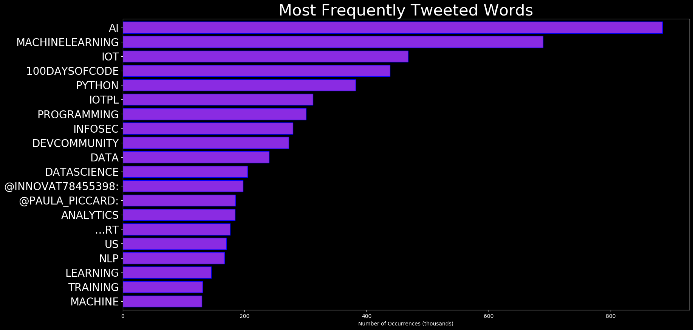
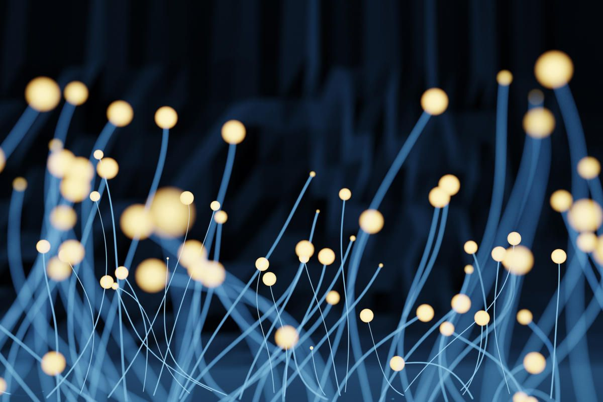
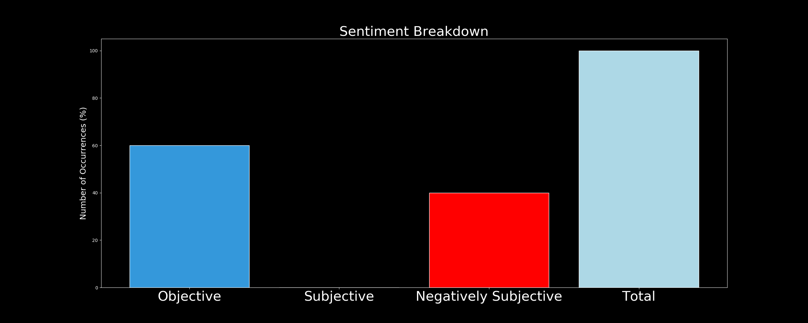

# DARKWIRE SOCIAL CYBER INSIGHTS 
&#x1F34E; **TOPIC = "cybersecurity"**

## AUTOMATED RESEARCH SUMMARY
     

|  Trending  |   Images | 
:-------------------------:|:-------------------------:
|        |   |   
 
 

  
The most popular user is: **YourAnonCentral**  
 

## Anonymous has been supporting Myanmar since 2014 through #OpRohingya and #OpKachin [https://t.co/6dFjja84bP]. 

We… https://t.co/76MsPL6Tsp 

  

### TRENDING SHARED IMAGE

|                **Sample-Tweets**        |
| :-------------: |
| How to Avoid #Phishing Emails and Scams https://t.co/T3LACxDeZ5 via @wired#InfoSec #Security #CyberSecurity… https://t.co/AxlsL1ZM3O |
| RT @rvp: I @rvp endorse this content@IoTCommunity rated me 2nd in #IoT #InternetOfThings@kcore_analytics rated me 12 in #QuantumComputi… |
| RT @hsanchez128: New to the @SASCDems, @SenJackyRosen announced today that she will sit the Subcommittee on Airland, the Subcommittee on Cy… |

## RELATED METRICS 
| Metric | Value |
| ------------- | ------------- |
| #1 Most tweeted to  | **Innovat78455398** |
| #2 Most tweeted to  | **Paula_Piccard** |
| #3 Most tweeted to  | **Eli_Krumova** |
| NewProfiles (less than 10 days) | 0.76%  |
| Tweeters with < 10 followers  | 2.16%|
| Tweeters with > 1000000 followers  | 0.0%  |

## MOST POPULAR TWEET TERMS 

| Popularity Rank  | Term |
| ------------- | ------------- |
| first  | **AI**  |
| second  | **MACHINELEARNING**  |
| third  | **IOT** |
| fourth  | **100DAYSOFCODE**  |
| fifth  | **PYTHON**  |

## Twitter Bio Analysis
### SENTIMENT ANALYSIS

VIEWS WERE : **SUBJECTIVE**  (0.0%) & **NEGATIVELY-SUBJECTIVE** (40.0%) **OBJECTIVE** (60.0%)

### TWEET SAMPLE 
| Random value picked from array |
| ------------- |
|RT @ingliguori: #infographic: How to implement #CyberSecurity via @ingliguori #infosec #CISO #Security #IIoT #IoTPL #DataScience #DigitalTr… |

### MOST RETWEETED 

| The most retweeted user is: **YourAnonCentral**  |
| ------------- |
| Anonymous has been supporting Myanmar since 2014 through #OpRohingya and #OpKachin [https://t.co/6dFjja84bP]. We… https://t.co/76MsPL6Tsp |

# Potential Fake Accounts
 
# CalefybTechUSER INFO

 
`User ScreenName:` CalefybTech 
 
`User chosen Name:` Calefyb 
 
`Is the User Verified?:` False 
 
`User signup date?:` Wed Feb 10 13:50:03 +0000 2021 
 
`User Description?:` One solution for all the software developer. 
 
`Followers?: `129 
 
`Following?:` 6 
 
`User URL?:` None 
 
`Location:`  
 
`Number of tweets extracted`  : 200 
 
`Profile image:` http://pbs.twimg.com/profile_images/1359858437165785089/WmqwnzK__normal.jpg 
 
`Number of tweets excluding replies:` 15127 
 

 

 
## User Top tweeted words 
 
**PAY** 57 , **100DAYSOFCODE** 39 , **ESSAY** 39 , **DAY** 36 , **JAVASCRIPT** 32 , **SOMEONE** 27 , **PHYSICS** 24 , **ESSAYPAY** 24 , **HELP** 24 , **ESSAYHELP** 23 , **PYTHON** 22 , **ENGLISH** 20 , **ONLINE** 20 , **ASSIGNMENTS** 19 , **MATHS** 18 , **DUE** 18 , **CODING** 17 , **PROJECT** 16 , **ESSAYDUE** 16 , **DM** 15 , 
 
## What this user tweeted
 
RT @KevinClarity: A Brief History of Machine Learning - DATAVERSITY

#Machinelearning #100DaysOfCode #IoT #IIoT #Bigdata #100DaysOfMLCode #…RT @Sirlupinwatson: What is #QuantumComputing Mini-Guide  

https://t.co/SZKRXwusFr

#MachineLearning #Python #NLP #Analytics #AI #100DaysO…RT @Paula_Piccard: Flying autonomous #robots that can pick fruits.

#MachineLearning #Python #NLP #Analytics #AI #100DaysOfCode
@mashable #…RT @arnold_smith1: TWC9: MSIgnite registration is open, Visual Studio Code 1.53, Azure Space Mystery Game,... https://t.co/BaQ00bbgvU via @…RT @thinksysinc: Want to know the #ML process? Here is an #infographic below.

Check out the 5 Steps in the #MachineLearning process.

#Pyt…RT @Innovat78455398: Your environment turns to #FPS game.  New type of #esports  #DEVCommunity #Programming #IoT #IoTPL #AI
#100DaysOfCode…RT @Innovat78455398: Removable heavy duty #chain. #DEVCommunity #Programming #IoT #IoTPL #AI
#100DaysOfCode #MachineLearning #Airdrop
#Clou…RT @Innovat78455398: Device converting body heat into electricity #DEVCommunity #Programming #IoT #IoTPL #AI
#100DaysOfCode #MachineLearnin…RT @Innovat78455398: First humanoid with full-body artificial skin. #DEVCommunity #Programming #IoT #IoTPL #AI
#100DaysOfCode #MachineLearn…RT @Innovat78455398: This is the reason why you should use #powerwalls of #tesla. #DEVCommunity #Programming #IoT #IoTPL #AI
#100DaysOfCode…RT @Innovat78455398: Browser history over the years. #DEVCommunity #Programming #IoT #IoTPL #AI
#100DaysOfCode #MachineLearning #Airdrop
#C…RT @Innovat78455398: #Future #tire goes like round. #DEVCommunity #Programming #IoT #IoTPL #AI
#100DaysOfCode #MachineLearning #Airdrop
#Cl…RT @Innovat78455398: Wheels gliding cars laterally. #DEVCommunity #Programming #IoT #IoTPL #AI
#100DaysOfCode #MachineLearning #Airdrop
#Cl…RT @KevinClarity: “Efficient Inference in Deep Learning — Where is the Problem?” 
https://t.co/Hd3PB2gUgh

#Machinelearning #100DaysOfCode…RT @KevinClarity: Statistical inference: learning in artificial neural networks - PubMed

#Machinelearning #100DaysOfCode #IoT #IIoT #Bigda…RT @KevinClarity: “The Actual Difference Between Statistics and Machine Learning” by @MatthewPStewart
https://t.co/XZiMJP5Lz8

#Machinelear…RT @KevinClarity: “Causal vs. Statistical Inference” by @vlastelicap
https://t.co/cWTucE5STh

#Machinelearning #100DaysOfCode #IoT #IIoT #B…RT @KevinClarity: How Causal Inference Can Lead To Real Intelligence In Machines

#Machinelearning #100DaysOfCode #IoT #IIoT #Bigdata #100D…RT @KevinClarity: “A Gentle Introduction To Math Behind Neural Networks” by @skdasaradh
https://t.co/zJtRzzkXLX

#Machinelearning #100DaysO…RT @KevinClarity: “Understanding the maths behind Neural Networks” by Valentina Alto
https://t.co/LW9CbC6b2c

#Machinelearning #100DaysOfCo…RT @KevinClarity: “Simplified Mathematics behind Neural Networks” by Shubham Dhingra
https://t.co/whD8XqFOC7

#Machinelearning #100DaysOfCo…RT @Eli_Krumova: Triangular Cross Relationship b/n #AI, #MachineLearning &amp; #DeepLearning
https://t.co/f9fsbUPNjS

#DevOps #Python #DataScie…RT @Eli_Krumova: Image Scrapping with #Python 
👉🏽https://t.co/oq2R6T5feB
v/ @boslerfabian

#Google #Datascience #BigData #DataAnalytics #An…
 
# thedavidcbaileyUSER INFO

 
`User ScreenName:` thedavidcbailey 
 
`User chosen Name:` David C. Bailey 
 
`Is the User Verified?:` False 
 
`User signup date?:` Tue Feb 16 22:13:00 +0000 2021 
 
`User Description?:` Husband, Father, Follower, Leader. 
Tech, Whiskey, Cigars, BBQ, Investing. 
@davidcbailey on #clubhouseapp 
 
`Followers?: `4 
 
`Following?:` 38 
 
`User URL?:` https://t.co/3ILBOwHs3F 
 
`Location:` Frisco, TX 
 
`Number of tweets extracted`  : 4 
 
`Profile image:` http://pbs.twimg.com/profile_images/1361841374581039105/wXe1MIkW_normal.jpg 
 
`Number of tweets excluding replies:` 4 
 

 

 
## User Top tweeted words 
 
**@HIBBSTER10** 2 , **@JASONWI12606404** 2 , **THANKS** 2 , **@MEETSLICK** 1 , **@SHADESOFCLOUD** 1 , **@NIGHTWORKERJS** 1 , **@CODENOVATION** 1 , **AWESOME!** 1 , **I'M** 1 , **GOING** 1 , **GIVE** 1 , **FOLLOW** 1 , **WATCH** 1 , **PLATF…** 1 , **HTTPS://TCO/ILAWSYLRPWREGARDLESS** 1 , **PARTY** 1 , **GOOD** 1 , **SOMEONE** 1 , **PROGRAMMING** 1 , **BACKGROUND** 1 , 
 
## What this user tweeted
 
Regardless of party, it is good to see someone with a programming background responsible for our #cybersecurity on… https://t.co/fdHExR44L3
 
# whatdefookUSER INFO

 
`User ScreenName:` whatdefook 
 
`User chosen Name:` Alley Stands9 