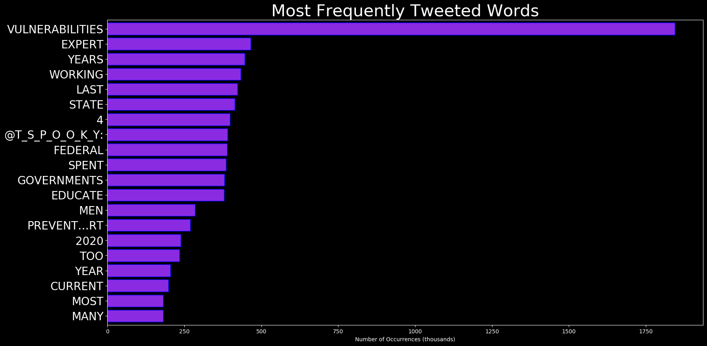
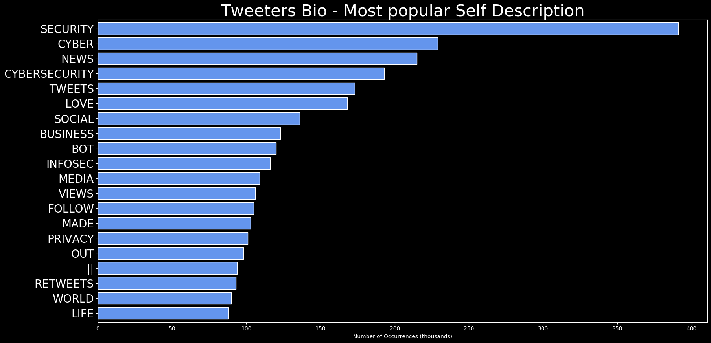
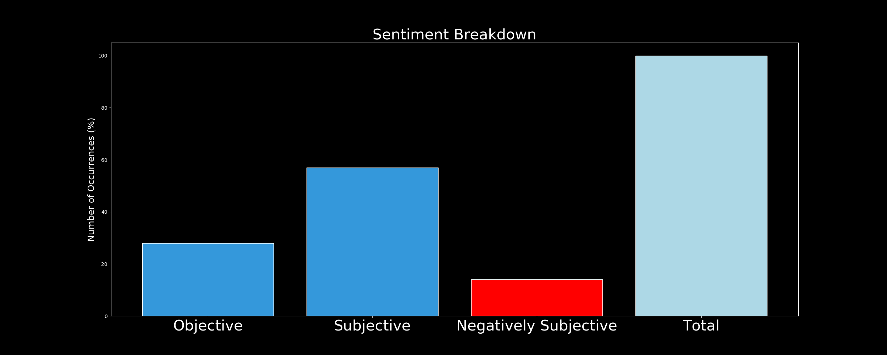

# DARKWIRE SOCIAL CYBER INSIGHTS 
&#x1F34E; **TOPIC = "vulnerabilities"**

## AUTOMATED RESEARCH SUMMARY
     

|  Trending  |   Images | 
:-------------------------:|:-------------------------:
|        |   |   
 
 

  
The most popular user is: **NatashaBertrand**  
 

## JUST OUT: Volume 5 of the Senate Intelligence Committee's Russia report, focused on counterintelligence threats and… https://t.co/SJk5xXBEIg 

  

### TRENDING SHARED IMAGE

|                **Sample-Tweets**        |
| :-------------: |
| #linux | #liuxsecurity | #computersecurity | Linux To Report MIPS Vulnerabilities But They Often Go Unreported Or D… https://t.co/ZlIUWljuul |
| @SenKamalaHarris USA Consituation protects your right to protect yourself any way you see fit. I suggest those who… https://t.co/dfplb3DCER |
| ‘Hack the Building’ Spotlights Vulnerabilities  #cybersecurity #vulnerabilitieshttps://t.co/zbsRuUgLHq |

## RELATED METRICS 
| Metric | Value |
| ------------- | ------------- |
| #1 Most tweeted to  | **T_S_P_O_O_K_Y** |
| #2 Most tweeted to  | **ECISVEEP** |
| #3 Most tweeted to  | **SpokespersonECI** |
| NewProfiles (less than 10 days) | 0.74%  |
| Tweeters with < 10 followers  | 3.94%|
| Tweeters with > 1000000 followers  | 0.06%  |

## MOST POPULAR TWEET TERMS 

| Popularity Rank  | Term |
| ------------- | ------------- |
| first  | **VULNERABILITIES**  |
| second  | **EXPERT**  |
| third  | **YEARS** |
| fourth  | **WORKING**  |
| fifth  | **LAST**  |

## Twitter Bio Analysis
### SENTIMENT ANALYSIS

VIEWS WERE : **SUBJECTIVE**  (57.14%) & **NEGATIVELY-SUBJECTIVE** (14.29%) **OBJECTIVE** (28.57%)

### TWEET SAMPLE 
| Random value picked from array |
| ------------- |
|RT @tonisha_miller: @Lucy56664003 @DmodosCutter @Parents_Utd @UKActionteam Imperial study finds new variant high in 0-9 age group.We both… |

### MOST RETWEETED 

| The most retweeted user is: **NatashaBertrand**  |
| ------------- |
| JUST OUT: Volume 5 of the Senate Intelligence Committee's Russia report, focused on counterintelligence threats and… https://t.co/SJk5xXBEIg |

# Potential Fake Accounts
 
# Mordredd2USER INFO

 
`User ScreenName:` Mordredd2 
 
`User chosen Name:` Mordredd 
 
`Is the User Verified?:` False 
 
`User signup date?:` Thu Dec 31 01:28:05 +0000 2020 
 
`User Description?:`  
 
`Followers?: `0 
 
`Following?:` 3 
 
`User URL?:` None 
 
`Location:`  
 
`Number of tweets extracted`  : 9 
 
`Profile image:` http://abs.twimg.com/sticky/default_profile_images/default_profile_normal.png 
 
`Number of tweets excluding replies:` 9 
 

 

 
## User Top tweeted words 
 
**@HIREZROMANOVA** 4 , **@HIREZSTUDIOS** 4 , **WOAH** 3 , **PEOPLE** 2 , **ENGINE** 2 , **BLAME** 2 , **DE** 2 , **@THUNDERBRUSH** 1 , **REALLY** 1 , **COLORS** 1 , **SHINY** 1 , **BORDERS** 1 , **EXCELLENT** 1 , **JOB** 1 , **@THUNDERBRUSH@OCTANEPROTV** 1 , **I'M** 1 , **ANGRY** 1 , **PROGRAMMER** 1 , **NOTHING** 1 , **ABOUT…** 1 , 
 
## What this user tweeted
 
@OctaneProTV @HiRezRomanova @HiRezStudios It's not that easy to hide those files, if they do want to have their fil… https://t.co/vxfWSFvl8r@OctaneProTV @HiRezRomanova @HiRezStudios Do not blame the studio, blame the engine, it's well known that Unreal En… https://t.co/6BBvySC0xS
 
# vintagepreciou2USER INFO

 
`User ScreenName:` vintagepreciou2 
 
`User chosen Name:` Athena 
 
`Is the User Verified?:` False 
 
`User signup date?:` Sun Jan 03 15:16:31 +0000 2021 
 
`User Description?:` REGULAR ACCT - vintageprecious while trumpie trys to silence me! 
 
`Followers?: `0 
 
`Following?:` 3 
 
`User URL?:` None 
 
`Location:`  
 
`Number of tweets extracted`  : 18 
 
`Profile image:` http://pbs.twimg.com/profile_images/1345751012548640768/OJ4FK6x7_normal.jpg 
 
`Number of tweets excluding replies:` 18 
 

 

 
## User Top tweeted words 
 
**SILENCE** 5 , **TEMP** 3 , **TRUTH** 3 , **TRUMPIE** 3 , **@VINTAGEPRECIOU2** 3 , **EXPOSE** 2 , **MOTTO** 2 , **WIN** 2 , **ACCT** 2 , **TRYING** 2 , **PREY** 2 , **WORTH** 2 , **COURSE;** 2 , **ADMITTING** 2 , **@JOEBIDEN** 2 , **@SPEAKERPELOSI** 2 , **Q;** 1 , **SAY** 1 , **TWEET** 1 , **ACCOUNT?** 1 , 
 
## What this user tweeted
 
@realDonaldTrump. "Narcissistic sociopaths prey onwomen with certain vulnerabilities. They go after them with a str… https://t.co/IF4ESp0wuZ
 
# EdC64467675USER INFO

 
`User ScreenName:` EdC64467675 
 
`User chosen Name:` Ed C. 
 
`Is the User Verified?:` False 
 
`User signup date?:` Tue Dec 29 17:22:36 +0000 2020 
 
`User Description?:` _?_ 
 
`Followers?: `4 
 
`Following?:` 194 
 
`User URL?:` None 
 
`Location:`  
 
`Number of tweets extracted`  : 132 
 
`Profile image:` http://pbs.twimg.com/profile_images/1344112647407611904/qrK8FoCY_normal.jpg 
 
`Number of tweets excluding replies:` 132 
 

 

 
## User Top tweeted words 
 
**TIME** 56 , **FIGHT** 54 , **UNITE** 53 , **INTEGRITY** 51 , **LAWS** 48 , **ELECTION'S** 43 , **VIOLATED** 36 , **FRAUD** 24 , **HAPPY** 19 , **NEW** 18 , **YEAR** 18 , **@MARSHABLACKBURN** 14 , **SENATOR** 14 , **@REALDONALDTRUMP** 10 , **@HAWLEYMO** 9 , **THAT'S** 8 , **@LAYTENITECOFFEE** 7 , **ELECTION** 7 , **ELECTIONS** 7 , **GEORGIA** 6 , 
 
## What this user tweeted
 
RT @KanekoaTheGreat: GEORGIA🚨

USB drives used in voting machines, but disabled in military's classified equipment systems because of *vuln…
 
# hostcogentUSER INFO

 
`User ScreenName:` hostcogent 
 
`User chosen Name:` hostcogent 
 
`Is the User Verified?:` False 
 
`User signup date?:` Wed Dec 30 08:02:00 +0000 2020 
 
`User Description?:` HostCogent: All the help and tools you need to grow online: Websites, Domains, Digital + Social Marketing, eCommerce, Bookkeeping and Web Security 
 
`Followers?: `10 
 
`Following?:` 41 
 
`User URL?:` https://t.co/t1J5Q0nhU7 
 
`Location:`  
 
`Number of tweets extracted`  : 21 
 
`Profile image:` http://pbs.twimg.com/profile_images/1344659654941540353/J1hb6-sy_normal.jpg 
 
`Number of tweets excluding replies:` 21 
 

 

 
## User Top tweeted words 
 
**WEBSITE** 5 , **HELP** 5 , **COGENT** 3 , **HTTPS://TCO/Y3JWHRESYZ** 3 , **TOOLS** 3 , **NEED** 3 , **GROW** 3 , **ONLINE:** 3 , **WEBSITES** 3 , **DOMAINS** 3 , **DIGITAL** 3 , **+** 3 , **SOCIAL** 3 , **@ROBREINER:** 2 , **AFTER** 2 , **MARKETS** 2 , **DESIGNED** 2 , **DEDICATED** 2 , **SERVER** 2 , **HTTPS://TCO/WPL1QKI0CR** 2 , 
 
## What this user tweeted
 
5 Most Common WordPress Security Vulnerabilities 
https://t.co/y3jwhrEsyz
1) Outdated Themes &amp; Plugins 
2) Nulled W… https://t.co/3YZxuoRZ18
 
# Arnabdey132USER INFO

 
`User ScreenName:` Arnabdey132 
 
`User chosen Name:` Arnab Dey 
 
`Is the User Verified?:` False 
 
`User signup date?:` Fri Jan 01 06:15:22 +0000 2021 
 
`User Description?:` Ambassador, Engineer, Developer, #Influencer, Columnist, Writer, Blogger, Photographer, #GoogleCertified #ML #CS #AI Enthusiast #5G #IoT #DigitalTransformation 
 
`Followers?: `289 
 
`Following?:` 538 
 
`User URL?:` https://t.co/bEgjcEDsWK 
 
`Location:` India 
 
`Number of tweets extracted`  : 200 
 
`Profile image:` http://pbs.twimg.com/profile_images/1345054808559001600/wFskTYPC_normal.jpg 
 
`Number of tweets excluding replies:` 996 
 

 

 
## User Top tweeted words 
 
**AI** 30 , **@MASHABLE:** 20 , **VIA** 15 , **DATA** 12 , **MACHINELEARNING** 11 , **NEW** 11 , **TECH** 10 , **CES2021** 9 , **ARTIFICIALINTELLIGENCE** 9 , **@JAMESVGINGERICH:** 9 , **@WEF:** 8 , **DIGITAL** 8 , **COULD** 8 , **2021** 8 , **CYBERSECURITY** 7 , **FINTECH** 7 , **2020** 7 , **IOT** 7 , **@DIGITALTRENDS:** 6 , **@NICOCHAN33:** 6 , 
 
## What this user tweeted
 
RT @TamaraMcCleary: 2021 #Cybersecurity Predictions: The Intergalactic Battle Begins https://t.co/vQUk3ZNe1M https://t.co/62z1xtv18ART @ThoHeller: Critical #vulnerabilities in #JSON Web Token libraries https://t.co/a8zABkfvgr by @auth0
 
# KevinMi67088489USER INFO

 
`User ScreenName:` KevinMi67088489 
 
`User chosen Name:` Kevin Mitchell 
 
`Is the User Verified?:` False 
 
`User signup date?:` Sat Dec 26 16:28:46 +0000 2020 
 
`User Description?:` I am a former pro boxer who competed from 2003 to 2015. I challenged twice for lightweight world championships; WBO title in 2012; & the WBC title in 2015 
 
`Followers?: `132 
 
`Following?:` 333 
 
`User URL?:` None 
 
`Location:`  
 
`Number of tweets extracted`  : 45 
 
`Profile image:` http://pbs.twimg.com/profile_images/1342870459717713921/Gyylteio_normal.jpg 
 
`Number of tweets excluding replies:` 45 
 

 

 
## User Top tweeted words 
 
**GOOD** 9 , **YH** 7 , **@EDDRAPER81** 5 , **@KEVINMITCHELL50** 5 , **MATE** 5 , **@KINGRYANG** 4 , **HE’S** 4 , **TIME** 3 , **VERY** 3 , **OLD** 3 , **BRO** 3 , **STILL** 3 , **FIGHT** 3 , **GARCIA** 3 , **LUKE** 3 , **WELL** 3 , **BACK** 3 , **AGREE** 2 , **BIT** 2 , **EXPERIENCE** 2 , 
 
## What this user tweeted
 
@JoshTaylorBoxer Needs time to mature josh. He showed vulnerabilities there and still has loads of time to improve@KingRyanG You did great to get up of the floor and win but you did show vulnerabilities last night. For a 22 year… https://t.co/yu895rGssI
 
# CoronilBUSER INFO

 
`User ScreenName:` CoronilB 
 
`User chosen Name:` Coronil Baba 
 
`Is the User Verified?:` False 
 
`User signup date?:` Sun Jan 03 11:06:27 +0000 2021 
 
`User Description?:`  
 
`Followers?: `55 
 
`Following?:` 127 
 
`User URL?:` None 
 
`Location:`  
 
`Number of tweets extracted`  : 200 
 
`Profile image:` http://pbs.twimg.com/profile_images/1345688055089221632/a0RB9CP__normal.jpg 
 
`Number of tweets excluding replies:` 286 
 

 

 
## User Top tweeted words 
 
**के** 56 , **की** 47 , **है** 35 , **का** 30 , **को** 29 , **में** 28 , **से** 26 , **पर** 20 , **किसान** 19 , **FARMERS** 18 , **जी** 17 , **ही** 14 , **नही** 13 , **ने** 13 , **कर** 13 , **सरकार** 12 , **MODI** 11 , **ये** 11 , **तो** 11 , **🇮🇳** 10 , 
 
## What this user tweeted
 
RT @naukarshah: A few simple questions to @ECISVEEP and @SpokespersonECI on the current EVM-VVPAT design and the vulnerabilities therein.…
 
# lorna_muchangiUSER INFO

 
`User ScreenName:` lorna_muchangi 
 
`User chosen Name:` Lorna Wanjiru Muchangi 
 
`Is the User Verified?:` False 
 
`User signup date?:` Sun Jan 03 08:11:10 +0000 2021 
 
`User Description?:` Love for thrill 🏂~~ 
Certified Network security analyst👩‍🎓 ~~ 
Shehacks Campus ambassador 2020👩‍⚖️~~
 Digital forensics enthusiast 🕵️‍♀️ ~~ 
 
`Followers?: `18 
 
`Following?:` 66 
 
`User URL?:` None 
 
`Location:` Kenya 
 
`Number of tweets extracted`  : 14 
 
`Profile image:` http://pbs.twimg.com/profile_images/1345644794278797312/Tr8EpgTJ_normal.jpg 
 
`Number of tweets excluding replies:` 14 
 

 

 
## User Top tweeted words 
 
**PEOPLE** 3 , **TWO** 2 , **NEW** 2 , **WELL** 2 , **?** 2 , **100DAYSOFCODE** 2 , **ETHICAL** 2 , **HACKING** 2 , **CHALLENGE** 2 , **YEAR** 2 , **PROGRESS** 2 , **LEARN** 2 , **STARTING** 2 , **GOOD** 2 , **DEV** 2 , **DEVELOPMENT** 2 , **RT** 1 , **@SHEINA_TECHIE:** 1 , **LAST** 1 , **2020🤗AM** 1 , 
 
## What this user tweeted
 
I have decided to start a ethical hacking challenge this year.
I will be sharing my progress as I learn to exploit… https://t.co/pLicWWpMAY
 
# Ka52905591USER INFO

 
`User ScreenName:` Ka52905591 
 
`User chosen Name:` Ka 
 
`Is the User Verified?:` False 
 
`User signup date?:` Thu Dec 31 17:58:30 +0000 2020 
 
`User Description?:`  
 
`Followers?: `2 
 
`Following?:` 400 
 
`User URL?:` None 
 
`Location:`  
 
`Number of tweets extracted`  : 200 
 
`Profile image:` http://abs.twimg.com/sticky/default_profile_images/default_profile_normal.png 
 
`Number of tweets excluding replies:` 1675 
 

 

 
## User Top tweeted words 
 
**@MAXIMUS_4EVR** 18 , **PRESIDENT** 13 , **HOUSE** 12 , **CALL** 12 , **PELOSI** 11 , **US** 11 , **SPEAKER** 9 , **ELECTION** 9 , **@MAXIMUS_4EVR:** 9 , **@REALDONALDTRUMP** 9 , **PEOPLE** 8 , **TRUMP** 8 , **@WETHEINEVITABLE:** 8 , **COUNTRY** 7 , **NEW** 7 , **CONGRESS** 7 , **SOME** 7 , **GOOD** 7 , **6TH** 7 , **STATE** 7 , 
 
## What this user tweeted
 
RT @kylenabecker: “And if they can exploit it, so could government-sponsored specialists working for another nation's intelligence agency”.…
 
# M3iST3RSL4D3USER INFO

 
`User ScreenName:` M3iST3RSL4D3 
 
`User chosen Name:` M3iST3RSL4D3 
 
`Is the User Verified?:` False 
 
`User signup date?:` Mon Dec 28 02:51:42 +0000 2020 
 
`User Description?:`  
 
`Followers?: `4 
 
`Following?:` 55 
 
`User URL?:` None 
 
`Location:`  
 
`Number of tweets extracted`  : 6 
 
`Profile image:` http://pbs.twimg.com/profile_images/1343393096562663424/X1PjHc8I_normal.png 
 
`Number of tweets excluding replies:` 6 
 

 

 
## User Top tweeted words 
 
**CYBERSECURITY** 4 , **CYBERSAFEPH** 2 , **FOLLOW** 1 , **@CVENEW** 1 , **@CVEANNOUNCE** 1 , **KEEP** 1 , **UPDATED** 1 , **LATEST** 1 , **VULNERABILITIES** 1 , **CYBERSECURITYCYBERSAFEPH** 1 , **HTTPS://TCO/288TX3QV9FCYBERSAFEPH** 1 , **HTTPS://TCO/OMSPJPH9CKCYBERSAFEPH** 1 , **HTTPS://TCO/ZTC9DU2I9QCYBERSAFEPH** 1 , **HTTPS://TCO/NNRS6YM9WWACG-CYBER** 1 , **SECURITY** 1 , **BULLETIN** 1 , **NR** 1 , **199:** 1 , **BEWARE** 1 , **LOKIBOT** 1 , 
 
## What this user tweeted
 
Follow @CVEnew and @CVEannounce to keep updated with the latest vulnerabilities.
#CyberSafePH
#cybersecurity
 
# MeinaisikyuhoonUSER INFO

 
`User ScreenName:` Meinaisikyuhoon 
 
`User chosen Name:` Rochana 
 
`Is the User Verified?:` False 
 
`User signup date?:` Fri Dec 25 17:46:34 +0000 2020 
 
`User Description?:` (she/her) ~ If I die, turn my tweets into a book.~ 
 
`Followers?: `15 
 
`Following?:` 13 
 
`User URL?:` None 
 
`Location:`  
 
`Number of tweets extracted`  : 38 
 
`Profile image:` http://pbs.twimg.com/profile_images/1342527399292899330/PZMFStky_normal.jpg 
 
`Number of tweets excluding replies:` 38 
 

 

 
## User Top tweeted words 
 
**DON'T** 4 , **PEOPLE** 4 , **PARENTS** 3 , **REALLY** 3 , **GIRL** 3 , **NEW** 3 , **YEAR** 3 , **STUDENTS** 3 , **HEAR** 3 , **THEN** 3 , **AFTER** 2 , **PRIVATE** 2 , **COLLEGE** 2 , **YEAR’S** 2 , **NUMBER** 2 , **BAD** 2 , **LOVE** 2 , **@AWWWKASH:** 2 , **ITS** 2 , **FOUND** 2 , 
 
## What this user tweeted
 
RT @redwineclouds: After therapy sessions, it is occurring to me how my parents and maybe most desi parents don't really grow as parents. F…
 
# SurlyBoxUSER INFO

 
`User ScreenName:` SurlyBox 
 
`User chosen Name:` SurlyBox 
 
`Is the User Verified?:` False 
 
`User signup date?:` Sat Jan 02 19:36:50 +0000 2021 
 
`User Description?:` Boxing Fan

BJJ/Wrestling/MMA too 
 
`Followers?: `7 
 
`Following?:` 143 
 
`User URL?:` None 
 
`Location:`  
 
`Number of tweets extracted`  : 28 
 
`Profile image:` http://pbs.twimg.com/profile_images/1345454119088226306/EmgZ9Mf3_normal.jpg 
 
`Number of tweets excluding replies:` 28 
 

 

 
## User Top tweeted words 
 
**GARCIA** 6 , **TANK** 4 , **YOUNG** 3 , **🤣🤣🤣** 3 , **GOOD** 3 , **HEAD** 3 , **SKINNY** 3 , **NECK** 3 , **HE'S** 3 , **OFF** 2 , **MAY** 2 , **@STEVEKIM323** 2 , **PLAYING** 2 , **PRESENTS** 2 , **HIMSELF** 2 , **T…** 2 , **TONIGHT** 2 , **TEO** 2 , **SHAKUR** 2 , **VS** 2 , 
 
## What this user tweeted
 
@jamesgogue Rewatched all Felix Trinidad's fights during quarantine. He was knocked down early so many times but it… https://t.co/vewN0ede5y
 
# uncommonfearsUSER INFO

 
`User ScreenName:` uncommonfears 
 
`User chosen Name:` Marshall. 
 
`Is the User Verified?:` False 
 
`User signup date?:` Sat Jan 02 02:57:49 +0000 2021 
 
`User Description?:` WARNING: This account contains trash jokes, a bone to pick over something, also spamming about how shitty the life was. 
 
`Followers?: `6 
 
`Following?:` 8 
 
`User URL?:` None 
 
`Location:` He/Him. 
 
`Number of tweets extracted`  : 149 
 
`Profile image:` http://pbs.twimg.com/profile_images/1345268223701225473/e4RNe2ie_normal.jpg 
 
`Number of tweets excluding replies:` 149 
 

 

 
## User Top tweeted words 
 
**GAK** 25 , **GUE** 18 , **KALAU** 18 , **ADA** 15 , **TAPI** 11 , **YANG** 10 , **INI** 10 , **UDAH** 10 , **SAYA** 10 , **LAGI** 10 , **YA** 10 , **ITU** 10 , **JADI** 10 , **BISA** 9 , **AJA** 9 , **MAU** 9 , **MAKAN** 8 , **HARUS** 8 , **KAMU** 8 , **TIDUR** 8 , 
 
## What this user tweeted
 
I had been in relationships with a manipulative person who took my vulnerabilities and threw them at me like a molo… https://t.co/ZSc6yMUe90
 
# 13ACR1USER INFO

 
`User ScreenName:` 13ACR1 
 
`User chosen Name:` Superbowl 2021 
 
`Is the User Verified?:` False 
 
`User signup date?:` Thu Dec 31 19:10:36 +0000 2020 
 
`User Description?:` Love to Post Football Polls 
 
`Followers?: `20 
 
`Following?:` 76 
 
`User URL?:` None 
 
`Location:` Germany 
 
`Number of tweets extracted`  : 97 
 
`Profile image:` http://pbs.twimg.com/profile_images/1345065915457675264/zgTA0qrK_normal.jpg 
 
`Number of tweets excluding replies:` 97 
 

 

 
## User Top tweeted words 
 
**@NFL** 31 , **GOOD** 12 , **TEAM** 9 , **@WASHINGTONNFL** 8 , **@NFLONFOX** 7 , **QB** 7 , **GIBSON** 6 , **🏈** 6 , **WASHINGTON** 6 , **/** 6 , **NFC** 5 , **SEASON** 5 , **PLAYOFFS** 5 , **RODGERS** 5 , **GREEN** 5 , **BAY** 5 , **GAME** 5 , **@VIVALARAZA7776** 5 , **LEX** 5 , **LUGER** 5 , 
 
## What this user tweeted
 
@WashingtonFanKC Looks that way. Needs a decent O coordiator and QB Coach to get him onto good start. 
Team has sev… https://t.co/KsPJcy4pwe
 
# Mark68121215USER INFO

 
`User ScreenName:` Mark68121215 
 
`User chosen Name:` RedOrDed 
 
`Is the User Verified?:` False 
 
`User signup date?:` Fri Jan 01 15:58:04 +0000 2021 
 
`User Description?:`  
 
`Followers?: `12 
 
`Following?:` 105 
 
`User URL?:` None 
 
`Location:`  
 
`Number of tweets extracted`  : 200 
 
`Profile image:` http://pbs.twimg.com/profile_images/1345036689996177408/Coctiyzg_normal.jpg 
 
`Number of tweets excluding replies:` 384 
 

 

 
## User Top tweeted words 
 
**LEFT** 20 , **PEOPLE** 19 , **DON’T** 12 , **LOCKDOWN** 10 , **@TNEWTONDUNN** 10 , **@TIMESRADIO** 10 , **STATE** 9 , **THESE** 9 , **@PAULMASONNEWS** 9 , **I’M** 9 , **@SHAUNG79** 9 , **LOCKDOWNS** 7 , **CHILDREN** 7 , **@JAMESMELVILLE** 7 , **SCIENCE** 7 , **THAN** 6 , **@DR_KROKOWSKI** 6 , **MANY** 6 , **SOME** 6 , **@DAWNHFOSTER** 5 , 
 
## What this user tweeted
 
@Telegraph Accepting that teachers with vulnerabilities or living with the vulnerable should be excluded, shouldn’t… https://t.co/67l9d4aSzj
 
# SuchetasinUSER INFO

 
`User ScreenName:` Suchetasin 
 
`User chosen Name:` Sucheta Singh 
 
`Is the User Verified?:` False 
 
`User signup date?:` Tue Dec 29 09:24:06 +0000 2020 
 
`User Description?:` देश के लिए प्यार है तो जताया करो, किसी का इंजतार मत करो… गर्व से बोलो ” जय हिन्द “ अभिमान से कहो भारतीय है हम…! ||  RTs not endorsements || 
 
`Followers?: `22 
 
`Following?:` 64 
 
`User URL?:` None 
 
`Location:`  
 
`Number of tweets extracted`  : 69 
 
`Profile image:` http://pbs.twimg.com/profile_images/1344202799408500737/2taix9gs_normal.jpg 
 
`Number of tweets excluding replies:` 69 
 

 

 
## User Top tweeted words 
 
**PAKISTAN** 33 , **PATHANKOTTERRORATTACK** 15 , **TERRORIST** 13 , **INDIA** 11 , **ARMY** 9 , **@JVLMK:** 8 , **COUNTRY** 8 , **TERRORISM** 7 , **ATTACKS** 6 , **PATHANKOT** 6 , **VARIOUS** 5 , **WHICH** 5 , **ALWAYS** 5 , **@MANISHG71240200:** 5 , **@DEFENDEROFIND:** 5 , **NEVER** 5 , **INDIAN** 5 , **USA** 5 , **की** 5 , **JEM** 4 , 
 
## What this user tweeted
 
RT @DefenderOfInd: “You throw 100 stones at me, I stop 90, still 10 hurt me &amp; I can never win.” What India needed to do instead was switch…
 
# Tony27841251USER INFO

 
`User ScreenName:` Tony27841251 
 
`User chosen Name:` Tony 
 
`Is the User Verified?:` False 
 
`User signup date?:` Wed Dec 30 07:46:27 +0000 2020 
 
`User Description?:` Insta@tonistark387 
 
`Followers?: `0 
 
`Following?:` 18 
 
`User URL?:` None 
 
`Location:`  
 
`Number of tweets extracted`  : 10 
 
`Profile image:` http://pbs.twimg.com/profile_images/1344865995874177025/a5DB7xdu_normal.jpg 
 
`Number of tweets excluding replies:` 10 
 

 

 
## User Top tweeted words 
 
**@EHACKERNEWS:** 3 , **TRY** 3 , **MICROSOFT** 2 , **SECURITY** 2 , **7** 2 , **HACKER** 2 , **1** 2 , **LEARN** 2 , **AGAIN** 2 , **@THEHACKERSNEWS:** 2 , **POSTED** 1 , **PHOTO** 1 , **HTTPS://TCO/B36YYHP8YPRT** 1 , **@CYBERSECURITYPR:** 1 , **ISSUED** 1 , **FIX** 1 , **ZERO-DAY** 1 , **SIX** 1 , **MONTHS** 1 , **AGO** 1 , 
 
## What this user tweeted
 
RT @EHackerNews: 2010-2020 Decade Roundup: 10 Most Frequently Occurred Security Vulnerabilities https://t.co/VKYzNXNHPL https://t.co/0hSDr4…
 
# TaliqBinMohamedUSER INFO

 
`User ScreenName:` TaliqBinMohamed 
 
`User chosen Name:` Baktun Pasha 
 
`Is the User Verified?:` False 
 
`User signup date?:` Mon Dec 28 07:29:20 +0000 2020 
 
`User Description?:` Justice Sabko Milega Inshallah Talah 
 
`Followers?: `62 
 
`Following?:` 1442 
 
`User URL?:` None 
 
`Location:`  
 
`Number of tweets extracted`  : 200 
 
`Profile image:` http://pbs.twimg.com/profile_images/1345827509615484929/BXP3F-ap_normal.jpg 
 
`Number of tweets excluding replies:` 3879 
 

 

 
## User Top tweeted words 
 
**SOLVESSRMURDERMYSTERYRT** 51 , **SOLVESSRMURDERMYSTERY** 27 , **SUSHANT** 21 , **:** 20 , **HAI** 15 , **K** 12 , **KA** 12 , **@ITSSSR** 11 , **CBI** 11 , **WARRIOR** 10 , **🇮🇳** 10 , **PLEASE** 9 , **KI** 9 , **SSR** 9 , **BHI** 8 , **GOOD** 8 , **NIGHT** 8 , **SSRIANS** 8 , **NAHI** 8 , **BOLLYWOOD** 8 , 
 
## What this user tweeted
 
RT @Cyberdost: Shopkeepers/Businessmen having their apps or websites must ensure that it is thoroughly tested for any IT Security vulnerabi…
 
# PalestinianFil1USER INFO

 
`User ScreenName:` PalestinianFil1 
 
`User chosen Name:` Palestinian Films 
 
`Is the User Verified?:` False 
 
`User signup date?:` Sun Dec 27 02:12:12 +0000 2020 
 
`User Description?:` https://t.co/3ENAVwxEIW 
 
`Followers?: `23 
 
`Following?:` 25 
 
`User URL?:` None 
 
`Location:`  
 
`Number of tweets extracted`  : 200 
 
`Profile image:` http://abs.twimg.com/sticky/default_profile_images/default_profile_normal.png 
 
`Number of tweets excluding replies:` 1246 
 

 

 
## User Top tweeted words 
 
**NEW** 14 , **YEAR** 8 , **WORK** 7 , **SOME** 7 , **MAKE** 7 , **2021** 7 , **UK** 6 , **THANK** 6 , **GOING** 5 , **FILM** 5 , **GOOD** 5 , **EVERYONE** 5 , **HUMAN** 5 , **JOIN** 5 , **LOOKING** 5 , **LIVE** 5 , **PEOPLE** 5 , 