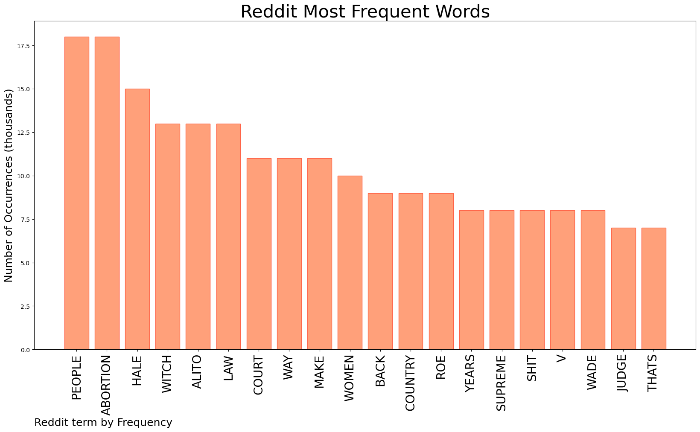
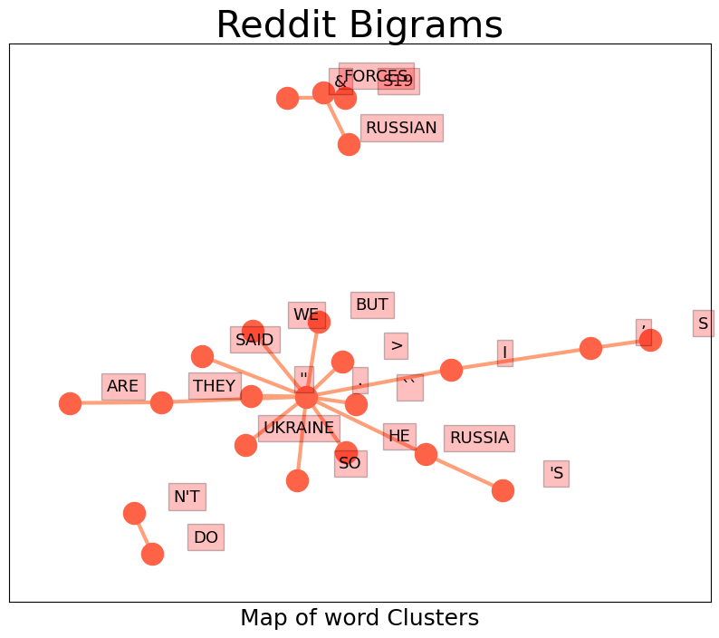

# REDDIT ANALYTICS
  
    

&#x1F355; **TOPIC = Roe v. Wade**  

    

 
  
  

    

# Reddit Word Clustering

 

 
  
  
  

# Reddit Citations
  

| Title | Upvote Ratio | URL| 
|-------|---|---------------| 
| Draft Overturning Roe v. Wade Quotes Witch Trial Judge | 0.93 | https://www.propublica.org/article/abortion-roe-wade-alito-scotus-hale | 
| UN says reproductive rights are ‘foundation’ of gender equality. A leaked Supreme Court draft opinion signaled the overturning of Roe v. Wade. | 0.98 | https://abcnews.go.com/amp/International/reproductive-rights-foundation-gender-equality/story?id=84491621 | 

## Reddit Deeper Dive 

## Number of Top Words: 8 Number of Occurences: 1 

Sample  
Words: PEOPLE ABORTION ALITO WAY MAKE WOMEN BACK YEARS 
     **IT DOESN'T EVEN QUOTE HIM CORRECTLY.

ALITO DOESN'T SEEM TO KNOW WHAT 'QUICKENED' IS, AND IT'S AMAZING HOW HE COULD FIND THESE OPINIONS TO USE IT WHILE NOT KNOWING WHY THAT WORD MIGHT APPEAR THERE. EDIT: IT'S BEEN POINTED OUT TO ME HE DOES DEFINE IT.

FUN FACT; ABORTION IS NOT NEW BUT THE PUSH TO MAKE IT FULLY ILLEGAL IS. THROUGH EARLIER AGES LAWS AGAINST ABORTION WERE OFTEN SPOTTY, UNENFORCED, OR IGNORED. YOU'LL FIND PLENTY OF LETTERS AND WRITINGS DISCUSSING IT AND THEY'RE NOT ALL ANTI-ABORTION DESPITE THE TIMES. PEOPLE THEN WERE FAR MORE NUANCED THAN YOU'D THINK. A LOT OF THEM LEFT THE ENTIRE QUESTION UP TO WOMEN, OR WOMEN SIMPLY KEPT THE MATTER ENTIRELY TO THEMSELVES.

YOU WILL SEE THE WORD 'QUICK' OR 'QUICKENED' SOMETIMES. THIS REFERS TO WHEN A BABY STARTS MOVING IN THE WOMB. SOME SOCIETIES EVEN THOUGHT THIS WAS THE MOMENT THE SOUL ENTERED THE BODY (I.E. YOU WEREN'T BORN WITH IT). ALITO CITES THESE SECTIONS AS THOUGH THEY MAKE ABORTION A CRIME, BUT THAT'S NOT WHAT THEY SAY. THEY SAY THAT ABORTING A CHILD AFTER IT HAS QUICKENED IS A CRIME. I.E. WHAT MIGHT NOW BE CALLED A LATE-STAGE ABORTION.

IF YOU'RE GOING TO CITE JURISTS FROM 400 YEARS AGO, AT LEAST DO US THE DECENCY OF CITING THEM CORRECTLY. THEN EXPLAIN WHY THE FUCK WE SHOULD CARE WHAT THIS ENGLISH BLOKE THOUGHT ABOUT THE MATTER. WHAT HAPPENED TO TEXTUALISM? I THOUGH CONSERVATIVES WERE HIGH ON THAT NOTION. IS ALITO SO SHORT ON A TEXTUAL BASIS HE HAS TO REACH ALL THE WAY BACK TO THE MAGNA CARTA?**: ` Sentence ` 

## Number of Top Words: 7 Number of Occurences: 1 

Sample  
Words: PEOPLE COURT WAY MAKE BACK COUNTRY SUPREME 
     **THANK YOU SUPREME COURT FOR SETTING THE U.S.A. BACK TO 1630'S PLYMOUTH ROCK.

THE CITIZENS OF THIS FINE COUNTRY APPRECIATE YOUR EFFORTS ON BEHALF OF A MAKE BELIEVE GOD AND A LOT OF WEALTHY PEOPLE WITH A LOT OF MONEY.

BY THE WAY AMY - HOW'S THAT MILLION DOLLAR BOOK DEAL COMING ALONG?

BY THE WAY KAVANAUGH THE YOWLER - WHO PAID OFF THAT MILLION DOLLARS YOU OWED?**: ` Sentence ` 

## Number of Top Words: 5 Number of Occurences: 3 

Sample  
Words: HALE ALITO WOMEN BACK YEARS 
     **HEADLINE TALKS ABOUT WITCHES.  ACTUAL IMPORTANCE IS THAT HALE IS THE GUY WHO MADE UP WHOLE CLOTH THE IDEA THAT WOMEN CAN’T BE RAPED BY THEIR HUSBANDS, AND MADE UP WHOLE CLOTH THE LEGAL IDEA THAT RAPE ACCUSATIONS ARE SUSPECT A PRIORI.  THESE IDEAS WERE PRECEDENT FOR 300 YEARS, UNTIL THE 1970S.

SO IN ORDER TO CITE PRECEDENT ALITO STRETCHED BACK 300 YEARS TO A GUY WHO LITERALLY MADE UP FROM SCRATCH IDEAS ABOUT HOW RAPISTS WEREN’T REALLY RAPISTS.  OKAY.**: ` Sentence ` 

## Number of Top Words: 4 Number of Occurences: 3 

Sample  
Words: HALE COURT WAY SUPREME 
     **EITHER:

1) A SUPREME COURT JUSTICE AGREES WITH HALE ON THESE TOPICS,

2) A SUPREME COURT JUSTICE DOESN'T THINK HALE'S VIEWS ON THIS ARE A PROBLEM, OR

3) A SUPREME COURT JUSTICE IS SO BAD AT LEGAL RESEARCH HE WAS UNAWARE THAT HALE HAD THESE VIEWS.

THERE IS NO WAY THIS ISN'T BAD.**: ` Sentence ` 

## Number of Top Words: 3 Number of Occurences: 9 

Sample  
Words: PEOPLE WITCH JUDGE 
     **WITCH TRIAL JUDGE THAT ALSO BELIEVED THAT GHOSTS SPEAKING TO PEOPLE IN THEIR SLEEP WAS ADMISSIBLE IN COURT.**: ` Sentence ` 

## Number of Top Words: 2 Number of Occurences: 14 

Sample  
Words: MAKE SHIT 
     **YOU CAN'T MAKE THIS SHIT UP !! NUTS ....**: ` Sentence ` 

## Number of Top Words: 1 Number of Occurences: 35 

Sample  
Words: JUDGE 
     **THIS ENGLISH JUDGE ALSO DIDN’T BELIEVE IT WAS POSSIBLE FOR A HUSBAND TO RAPE HIS WIFE BECAUSE MARRIAGE = PERMANENT CONSENT OR SOMETHING.**: ` Sentence ` 

  
     

    
*All major SubReddits scanned for chosen topic, word frequency of all comments ranked above*  

  

  
### CONCLUSION & EXTERNAL ANALYSIS  

 
*This is my [Adam McMurchie`s] opinion on the data from the tweets, it serves as no objective truth.Since the tweets themselves are a mixture of fact & opinion.
 
Authors analytical summary on request.
**RECOMMENDATIONS** WILL BE UPDATED IN NEXT  24 HOURS 
    

  

    