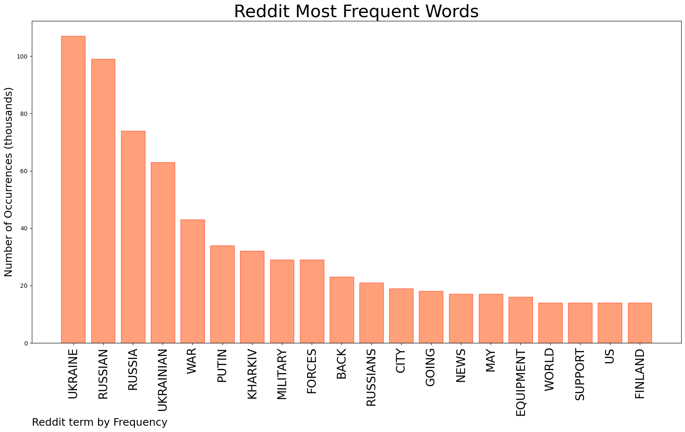

# REDDIT ANALYTICS
  
    

&#x1F34E; **TOPIC = Ukraine**  

    

 
  
  

    

# Reddit Word Clustering

 

 
  
  
  

# Reddit Citations
  

| Title | Upvote Ratio | URL| 
|-------|---|---------------| 
| Ukraine wins battle for city of Kharkiv – reports | 0.97 | https://www.bbc.co.uk/news/live/world-europe-61441664 | 
| /r/WorldNews Live Thread: Russian Invasion of Ukraine Day 80, Part 1 (Thread #220) | 0.95 | https://www.reddit.com/live/18hnzysb1elcs | 
| Russian forces are withdrawing from Kharkiv, Ukraine says | 0.97 | https://www.theguardian.com/world/2022/may/14/ukraine-says-russian-forces-withdrawing-kharkiv | 
| Hungary's new President Katalin Novak condemns Russia's invasion of Ukraine and said her first trip would take her to Poland, in an apparent gesture to mend relations with Warsaw. | 0.96 | https://www.reuters.com/world/europe/hungarys-new-president-condemns-putins-aggression-plans-trip-warsaw-2022-05-14/ | 

## Reddit Deeper Dive 

## Number of Top Words: 11 Number of Occurences: 1 

Sample  
Words: UKRAINE RUSSIAN RUSSIA UKRAINIAN WAR PUTIN MILITARY FORCES BACK GOING NEWS 
     **FROM UKRAINIAN INTELLIGENCE, VIA SKY NEWS CONFIRMED BY GUR. 

"UKRAINE'S HEAD OF MILITARY INTELLIGENCE SAYS THE WAR WITH RUSSIA IS GOING SO WELL, THAT IT WILL REACH A TURNING POINT BY MID-AUGUST AND BE OVER BY THE END OF THE YEAR.

IT IS THE MOST PRECISE AND OPTIMISTIC PREDICTION BY A SENIOR UKRAINIAN OFFICIAL SO FAR.

IN AN EXCLUSIVE INTERVIEW WITH SKY NEWS, MAJOR GENERAL KYRYLO BUDANOV ALSO SAID A COUP TO REMOVE VLADIMIR PUTIN IS ALREADY UNDER WAY IN RUSSIA AND THE RUSSIAN LEADER IS SERIOUSLY ILL WITH CANCER.

RUSSIAN AGENTS 'BELIEVE PUTIN IS TERMINALLY ILL' - UKRAINE NEWS LIVE

THE GENERAL'S OFFICE IS DARK AND STUFFED WITH THE PARAPHERNALIA OF WAR AND ESPIONAGE, SANDBAGS STACKED ON ITS WINDOWS, MACHINE GUNS PILED ON THE FLOOR, AND A SPARE RIFLE MAGAZINE ON HIS DESK USED AS A PAPERWEIGHT.

HE IS REMARKABLY YOUNG TO LEAD HIS COUNTRY'S MILITARY INTELLIGENCE AGENCY AT JUST 36 YEARS AND SPEAKS WITH THE DRY PRECISION OF HIS TRADE.

HE SHOWED LITTLE EMOTION, SMILING ONLY ONCE AS HE SAID IN ENGLISH: "I'M OPTIMISTIC."

GENERAL BUDANOV CORRECTLY PREDICTED WHEN THE RUSSIAN INVASION WOULD HAPPEN WHEN OTHERS IN HIS GOVERNMENT WERE PUBLICLY SCEPTICAL AND NOW SAYS HE IS CONFIDENT ABOUT PREDICTING ITS CONCLUSION.

"THE BREAKING POINT WILL BE IN THE SECOND PART OF AUGUST.

"MOST OF THE ACTIVE COMBAT ACTIONS WILL HAVE FINISHED BY THE END OF THIS YEAR.

"AS A RESULT, WE WILL RENEW UKRAINIAN POWER IN ALL OUR TERRITORIES THAT WE HAVE LOST INCLUDING DONBAS AND THE CRIMEA."

RUSSIA'S TACTICS HAVE NOT CHANGED DESPITE ITS SHIFT TO THE EAST HE SAYS, AND RUSSIA IS SUFFERING HUGE LOSSES THOUGH HE WOULD NOT BE DRAWN ON UKRAINIAN CASUALTIES.

RUSSIA JUST A 'HORDE OF PEOPLE WITH WEAPONS'

HE SAID HE WAS NOT SURPRISED BY RUSSIA'S SETBACKS IN THE WAR.

"WE KNOW EVERYTHING ABOUT OUR ENEMY. WE KNOW ABOUT THEIR PLANS ALMOST AS THEY'RE BEING MADE.

"EUROPE SEES RUSSIA AS A BIG THREAT. THEY ARE AFRAID OF ITS AGGRESSION.

"WE HAVE BEEN FIGHTING RUSSIA FOR EIGHT YEARS AND WE CAN SAY THAT THIS HIGHLY PUBLICISED RUSSIAN POWER IS A MYTH.

"IT IS NOT AS POWERFUL AS THIS. IT IS A HORDE OF PEOPLE WITH WEAPONS."

RUSSIAN FORCES HAVE BEEN PUSHED BACK ALMOST TO THE BORDER AROUND KHARKIV, HE SAYS, AND A RECENT ATTACK ON FORCES FURTHER SOUTH TRYING TO CROSS THE SIVERSKYY DONETS CAUSED CONSIDERABLE DAMAGE.

ITS AFTERMATH HAS BEEN CAUGHT IN DRAMATIC AERIAL PICTURES.

"I CAN CONFIRM THAT THEY SUFFERED HEAVY LOSSES IN MANPOWER AND ARMOUR AND I CAN SAY THAT WHEN THE ARTILLERY STRIKES HAPPENED MANY OF THE CREWS ABANDONED THEIR EQUIPMENT," GENERAL BUDANOV SAID.

'IMPOSSIBLE TO STOP COUP'

GENERAL BUDANOV ALSO TOLD SKY NEWS DEFEAT IN UKRAINE WOULD LEAD TO THE REMOVAL OF RUSSIA'S LEADER AND THE COUNTRY'S DISINTEGRATION.

"IT WILL EVENTUALLY LEAD TO THE CHANGE OF LEADERSHIP OF THE RUSSIAN FEDERATION. THIS PROCESS HAS ALREADY BEEN LAUNCHED AND THEY ARE MOVING INTO THAT WAY."

DOES THAT MEAN A COUP IS UNDER WAY?

"YES," HE RESPONDED.

"THEY ARE MOVING IN THIS WAY AND IT IS IMPOSSIBLE TO STOP IT."

HE CLAIMED MR PUTIN IS IN A "VERY BAD PSYCHOLOGICAL AND PHYSICAL CONDITION AND HE IS VERY SICK".

THE RUSSIAN LEADER HAS CANCER AND OTHER ILLNESSES, HE SAYS.

HE DISMISSED SUGGESTIONS HE WAS SPREADING PROPAGANDA AS PART OF THE INFORMATION WAR AND WAS CERTAIN OF HIS CLAIMS.

"IT'S MY JOB, IT'S MY WORK, IF NOT ME WHO WILL KNOW THIS?"

UKRAINIAN OFFICIALS HAVE CAST DOUBTS ABOUT MR PUTIN'S MENTAL AND PHYSICAL WELL-BEING BEFORE AND DECLARED THEIR CERTAINTY ABOUT EVENTUALLY WINNING, BUT UNTIL THIS INTERVIEW, NONE HAVE BEEN SO SPECIFIC AND LAID OUT A TIMELINE FOR VICTORY, A SIGN OF THEIR INCREASING CONFIDENCE ON THE BATTLEFIELD."

HTTPS://NEWS.SKY.COM/STORY/UKRAINE-WAR-MILITARY-INTELLIGENCE-CHIEF-OPTIMISTIC-OF-RUSSIAN-DEFEAT-SAYING-WAR-WILL-BE-OVER-BY-END-OF-YEAR-12612320

HTTPS://GUR.GOV.UA/CONTENT/VIINA-DOSIAHNE-PERELOMNOHO-MOMENTU-V-SERPNI-KYRYLO-BUDANOV.HTML**: ` Sentence ` 

## Number of Top Words: 10 Number of Occurences: 1 

Sample  
Words: RUSSIAN UKRAINIAN WAR KHARKIV MILITARY FORCES BACK CITY MAY FINLAND 
     **IT'S JUST AFTER MIDDAY IN UKRAINE. IF YOU'RE JUST JOINING OUR COVERAGE, OR WANT A RECAP, HERE'S A SUMMARY OF HOW THINGS STAND:

UKRAINE HAS "LIKELY WON THE BATTLE OF KHARKIV", A WELL-KNOWN MILITARY THINK-TANK, THE INSTITUTE FOR THE STUDY OF WAR, SAYS. RUSSIAN FORCES WHICH HAD BEEN TRYING TO ENCIRCLE THE NORTH-EASTERN CITY SEEM TO HAVE GIVEN UP AND LEFT THE AREA, IT SAYS

RUSSIAN FORCES HAVE BEEN PUSHED BACK FROM KHARKIV TOWARDS THE BORDER - AND THE UKRAINIAN MILITARY LEADERSHIP NOW SAYS THE "ENEMY'S MAIN EFFORTS ARE FOCUSED ON ENSURING THE WITHDRAWAL OF ITS UNITS" ABOVE ANYTHING ELSE

THE GOVERNOR OF THE KHARKIV REGION SAYS THAT RESIDENTS HAVE STARTED RETURNING TO THE CITY TO DEAL WITH THE DESTRUCTION LEFT IN THE WAKE OF THE BATTLE - BUT WARNS IT MAY NOT YET BE SAFE

SEPARATELY, THE HEAD OF UKRAINE'S MILITARY INTELLIGENCE PREDICTS THE WAR WILL BE OVER BY YEAR'S END; IN AN INTERVIEW WITH SKY NEWS, MAJOR GENERAL KYRYLO BUDANOV SAID THE TURNING POINT WOULD BE MID-AUGUST

AND SWEDEN AND FINLAND ARE BOTH INVITED TO ATTEND A MEETING OF NATO FOREIGN MINISTERS ON SATURDAY AS GUESTS - WHILE THE KREMLIN REPEATS ITS WARNINGS OF UNSPECIFIC CONSEQUENCES IF THEY GO AHEAD WITH JOINING THE WESTERN MILITARY ALLIANCE

BBC NEWS, LIVE UPDATES.**: ` Sentence ` 

## Number of Top Words: 9 Number of Occurences: 2 

Sample  
Words: UKRAINE RUSSIAN RUSSIA UKRAINIAN WAR MILITARY EQUIPMENT WORLD SUPPORT 
     **RUSSIA HAS DELIBERATELY DECIDED TO EXTEND THE MILITARY WAR AGAINST UKRAINE INTO A GRAIN WAR, GERMAN FOREIGN MINISTER ANNALENA BAERBOCK SAID DURING THE CONCLUDING PRESS CONFERENCE OF THE G7 FOREIGN MINISTERS MEETING IN GERMANY.

"RUSSIA'S ACTIONS ARE CAUSING SUPPLIES TO FAIL, PRICES TO RISE IMMEASURABLY — NOT ONLY IN OUR COUNTRY BUT AROUND THE WORLD — AND THE THREAT OF BRUTAL HUNGER,“ BAERBOCK SAID. 

"WE MUST NOT BE NAÏVE — THIS IS NOT COLLATERAL DAMAGE. IT IS A DELIBERATELY CHOSEN INSTRUMENT IN A HYBRID WAR THAT IS BEING WAGED RIGHT NOW,“ SHE ADDED. 

"RUSSIA IS PREPARING THE BREEDING GROUND FOR NEW CRISES IN ORDER TO DELIBERATELY WEAKEN INTERNATIONAL COHESION AGAINST RUSSIA'S WAR,“ SAID BAERBOCK. "HUNGER, INSTABILITY, ENERGY INSECURITY, THE CREEPING EROSION OF DEMOCRATIC VALUES, BUT ALSO OF HUMAN RIGHTS THROUGH DISINFORMATION" ARE CAUSED BY THE RUSSIAN AGGRESSION ON UKRAINE, BAERBOCK SAID. 

SOME BACKGROUND: RUSSIA AND UKRAINE BOTH PRODUCE ALMOST 30% OF GLOBAL WHEAT EXPORTS. RUSSIAN TROOPS HAVE BEEN STEALING FARM EQUIPMENT AND THOUSANDS OF TONS OF GRAIN FROM UKRAINIAN FARMERS, AS WELL AS TARGETING FOOD STORAGE SITES WITH ARTILLERY, ACCORDING TO SOURCES. UKRAINE'S DEFENSE MINISTRY SAID LAST WEEK THAT AN ESTIMATED 400,000 TONS OF GRAIN HAD BEEN STOLEN BY RUSSIAN TROOPS. AND CNN TRACKED A RUSSIAN SHIP LOADED WITH NEARLY 30,000 TONS OF UKRAINIAN GRAIN THAT WAS TURNED AWAY FROM TWO MEDITERRANEAN PORTS BEFORE LANDING IN SYRIA.

"HOW WE ACT, OR HOW WE DON'T ACT, WILL SHAPE THE WAY WE LIVE TOGETHER IN THE WORLD FOR MANY YEARS OR PERHAPS DECADES TO COME. THAT IS WHY DUCKING OUT OF THE WAY, PASSIVITY OR DITHERING, HESITATION, AND THEN IN THE END SAYING NOTHING AT ALL, IS NOT AN OPTION FOR US, FOR ME PERSONALLY," BAERBOCK SAID. 

"HAVING HAD TO MAKE MANY DECISIONS IN RECENT WEEKS TO SUPPORT UKRAINE IN A SPRINT," BAERBOCK NOW FEARS THAT THE ALLIANCE MUST PREPARE FOR "A LONG-DISTANCE RACE" TO "TO FIGHT THIS GLOBAL CRISIS."

"WE WILL NEVER RECOGNIZE BORDER CHANGES THAT RUSSIA WANTS TO ENFORCE BY MILITARY FORCE,“ BAERBOCK ADDED. 

CNN LIVE UPDATES.**: ` Sentence ` 

## Number of Top Words: 8 Number of Occurences: 2 

Sample  
Words: UKRAINE RUSSIAN UKRAINIAN WAR FORCES RUSSIANS MAY EQUIPMENT 
     **SATELLITE IMAGERY AND FIRST-HAND TESTIMONY HAVE PROVIDED A FULLER PICTURE OF THE MULTIPLE AND DISASTROUS EFFORTS BY RUSSIAN FORCES TO CROSS THE SIVERSKYI DONETS RIVER IN EASTERN UKRAINE OVER THE PAST WEEK.

NEW VIDEO AND ANALYSIS OF DRONE AND SATELLITE IMAGERY SHOW THAT THE RUSSIANS MAY HAVE LOST AS MANY AS 70 ARMORED VEHICLES AND OTHER EQUIPMENT IN ATTEMPTING TO CROSS THE RIVER EARLY THIS WEEK. THEIR GOAL WAS TO TRY TO ENCIRCLE UKRAINIAN DEFENSES IN THE LUHANSK REGION, BUT IT FAILED SPECTACULARLY. 

IN ITS ACCOUNT OF THE BATTLE, UKRAINE'S 80TH SEPARATE ASSAULT BRIGADE SAID IT HAD "DESTROYED THE PONTOONS AND THWARTED NINE CROSSING ATTEMPTS."

IT CLAIMED THAT "AT LEAST 73 UNITS OF EQUIPMENT WERE DESTROYED, INCLUDING T-72 TANKS" AND A VARIETY OF INFANTRY FIGHTING VEHICLES.

THIS TALLY APPEARS SUPPORTED BY ANALYSIS OF DRONE VIDEO SHOWING RUSSIAN EQUIPMENT STREWN ALONG A TRACK TO THE NORTH OF THE RIVER, AS WELL AS HALF-SUBMERGED TANKS.

IT'S CLEAR THAT THE UKRAINIANS HAD PREVIOUSLY WORKED OUT WHERE THE RUSSIANS WERE LIKELY TO TRY TO LAY DOWN THE PONTOONS AND HAD OBSERVED THE APPROACH OF RUSSIAN UNITS. RECONNAISSANCE OF POSSIBLE CROSSING POINTS HAD BEGUN AT LEAST TWO DAYS BEFORE THE RUSSIAN ATTEMPT.

THE SIVERSKYI DONETS FLOWS QUICKLY AND THE RUSSIANS APPEAR TO HAVE NEEDED MOTORIZED TUGS TO TRY TO COMPLETE THE BRIDGE. THE NOISE WAS A FURTHER CLUE TO UKRAINIAN UNITS THAT AN ATTEMPT TO FORD THE RIVER WAS UNDERWAY.

IN ITS ACCOUNT, THE 80TH BRIGADE SAYS THAT "DESPITE HEAVY LOSSES, THE ENEMY STILL MANAGED TO BREAK THROUGH ... GAINING A FOOTHOLD ON THE NORTHERN OUTSKIRTS OF ONE OF THE SETTLEMENTS." AT LEAST 30 RUSSIAN VEHICLES AND INFANTRY DID MAKE THE CROSSING. 

OTHER UKRAINIAN OFFICIALS SAY THAT THOSE RUSSIAN UNITS THAT DID GET ACROSS, NORTH OF THE VILLAGE OF BILOHORIVKA, WERE STRANDED.

"FIERCE, HEAVY FIGHTING LASTED ABOUT TWO DAYS," THE 80TH BRIGADE SAID ON ITS FACEBOOK PAGE. "THE PARATROOPERS DESTROYED A WHOLE BATTALION-TACTICAL GROUP (BTG) OF INVADERS!"
OPEN SOURCE ANALYSIS SUGGESTS THIS IS PROBABLY TRUE, WITH AT LEAST 30 INFANTRY FIGHTING VEHICLES COUNTED AMONG THE WRECKAGE AT THE SITE OF THE PONTOON, NOT COUNTING WHAT MAY HAVE BEEN DESTROYED AMONG THE EQUIPMENT THAT DID GET ACROSS.

IN ITS ANALYSIS OF THE EPISODE, THE INSTITUTE FOR THE STUDY OF WAR SAID THAT "UKRAINIAN FORCES LIKELY INFLICTED HEAVY CASUALTIES ON RUSSIAN FORCES ATTEMPTING TO CROSS THE SIVERSKYI DONETS RIVER."

"RUSSIAN FORCES HAVE LIKELY LOST THE MOMENTUM NECESSARY TO EXECUTE A LARGE-SCALE CROSSING OF THE SIVERSKYI DONETS RIVER," IT ADDED.

MICK RYAN, A FORMER MAJOR GENERAL IN THE AUSTRALIAN ARMED FORCES WHO STUDIES THE UKRAINIAN CONFLICT, TWEETED: "RUSSIANS CLEARLY INTENDED TO INVEST IN THIS AXIS AND THROW A LOT OF COMBAT POWER DOWN IT.

"CONSEQUENTLY, THIS IS PROBABLY A LARGER SETBACK FOR THE RUSSIANS THAN SOME HAVE SPECULATED," RYAN SAID IN A POST PUBLISHED TO HIS VERIFIED TWITTER ACCOUNT.

IT HAS LIKELY RESULTED IN NOT JUST A BTG BUT PROBABLY AN ENTIRE BRIGADE LOSING A LARGE PART OF ITS COMBAT POWER."
"IMPORTANTLY, THE RUSSIANS LOST SCARCE ENGINEER BRIDGING EQUIPMENT (AND PROBABLY COMBAT ENGINEERS TOO). THESE RESOURCES ARE NEITHER CHEAP NOR AVAILABLE IN LARGE QUANTITIES. AND THESE ARE IN HIGH DEMAND DURING AN OFFENSIVE."

THE RUSSIANS' INABILITY TO ADVANCE FROM THE NORTH ACROSS THE RIVER HAS LIKELY SLOWED DOWN ITS OFFENSIVE IN LUHANSK, WHICH FOR NOW IS RELIANT ON TROOPS MOVING FROM THE EAST AND SOUTH THROUGH FRONTLINES THAT HAVE MOVED LITTLE IN A MONTH.

CNN LIVE UPDATES.**: ` Sentence ` 

## Number of Top Words: 7 Number of Occurences: 5 

Sample  
Words: UKRAINE RUSSIA WAR MILITARY FORCES BACK SUPPORT 
     **WANGELS, GERMANY: 

THE GROUP OF SEVEN INDUSTRIALIZED NATIONS SAID SATURDAY THEY WOULD NEVER RECOGNIZE THE BORDERS RUSSIA IS TRYING TO SHIFT IN ITS WAR AGAINST UKRAINE AND PLEDGED ENDURING SUPPORT FOR KYIV.
RUSSIA INVADED UKRAINE ON FEBRUARY 24 BUT KYIV’S FORCES MANAGED TO PUSH MOSCOW’S TROOPS BACK FROM THE CAPITAL. THE CONFLICT IS NOW WELL INTO ITS THIRD MONTH.

“WE WILL NEVER RECOGNIZE BORDERS RUSSIA HAS ATTEMPTED TO CHANGE BY MILITARY AGGRESSION, AND WILL UPHOLD OUR ENGAGEMENT IN THE SUPPORT OF THE SOVEREIGNTY AND TERRITORIAL INTEGRITY OF UKRAINE, INCLUDING CRIMEA, AND ALL STATES,” THE G7 FOREIGN MINISTERS SAID IN A STATEMENT AFTER THREE DAYS OF TALKS IN NORTHERN GERMANY.**: ` Sentence ` 

## Number of Top Words: 6 Number of Occurences: 2 

Sample  
Words: UKRAINE RUSSIA RUSSIANS GOING MAY US 
     **I THINK ONE OF THE BIG LESSONS FROM THE BOTCHED BILOHORIVKA RIVER FORDING ATTEMPT FOR OBSERVERS LIKE US IS THAT THERE MIGHT BE HUGE, STRATEGICALLY IMPORTANT BATTLES GOING ON AT ANY TIME NEITHER UKRAINE NOR RUSSIA WILL COMMENT ON AND WE WON'T KNOW ABOUT. 

HTTPS://TWITTER.COM/CMD_OPT_SHIFT/STATUS/1525296845357842432

THE BILOHORIVKA BATTLE HAD STARTED MAY 2ND, AND THE RUSSIANS GOT QUITE FAR INTO SOME OF THE SETTLEMENTS AROUND THE BRIDGEHEAD BEFORE THEY WERE BEATEN BACK, YET THE FIRST TIME WE EVEN NOTICED THERE WAS SOMETHING GOING ON WAS MAY 9TH WHEN UKRAINE DECLARED THAT THE BRIDGES HAD BEEN DESTROYED - AND THE FIRST IMAGES SURFACED. 

LET THAT SINK IN. THAT BATTLE HAD RAGED FOR A WHOLE WEEK BEFORE WE IN THIS THREAD EVEN GOT A SNIFF THAT A BRIDGING ATTEMPT TO ENCIRCLE SEVERODONETSK WAS GOING ON!**: ` Sentence ` 

## Number of Top Words: 5 Number of Occurences: 7 

Sample  
Words: UKRAINIAN KHARKIV MILITARY FORCES US 
     **"ON THE IZYUM DIRECTION IN THE KHARKIV REGION, UKRAINIAN DEFENDERS WENT ON THE COUNTERATTACK.  

SOURCE:  HEAD OF THE KHARKIV REGIONAL MILITARY ADMINISTRATION  OLEH SYNEGUBOV

DIRECT SPEECH : "THE HOTTEST POINT FOR US IS THE IZYUM DIRECTION. THERE OUR ARMED FORCES WENT ON THE COUNTERATTACK. 

THE ENEMY IS RETREATING IN SOME AREAS - THIS IS THE RESULT OF THE NATURE OF OUR ARMED FORCES. " "

GOOGLE TRANSLATED FROM UKRAINIAN PRAVDA: HTTPS://WWW.PRAVDA.COM.UA/NEWS/2022/05/14/7346149/**: ` Sentence ` 

## Number of Top Words: 4 Number of Occurences: 14 

Sample  
Words: UKRAINE RUSSIAN UKRAINIAN GOING 
     **LOL NOW OUR CRYPTO/CONCERN TROLL THINKS THAT NONE OF THIS HAPPENED:

- RUSSIAN PARATROOPERS DROPPING INTO KYIV DAY ONE TO TRY TO TAKE OUT ZELENSKYY

HTTPS://NYPOST.COM/2022/04/29/CHILLING-NEW-DETAILS-ABOUT-RUSSIAN-HITMEN-TARGETING-ZELENSKY/

- RUSSIAN UNITS GIVEN ORDERS TO INVADE UKRAINE DESPITE HAVING HAD NO INCLINATION THAT WAS GOING TO HAPPEN IMMEDIATELY PRIOR TO THE WAR, UP TO AND INCLUDING GENERALS; 

HTTPS://WWW.THEGUARDIAN.COM/WORLD/2022/MAR/04/RUSSIAN-SOLDIERS-UKRAINE-ANGER-DUPED-INTO-WAR

HTTPS://THEWEEK.COM/RUSSO-UKRAINIAN-WAR/1010586/PUTINS-INNER-CIRCLE-REPORTEDLY-SEEMED-TO-THINK-HIS-MILITARY-BUILDUP-WAS

- PRELIMINARY WORK DONE TO TRY TO ENSURE THAT UKRAINE WOULD NOT RESIST.  ANYBODY NOTICE HOW THE SOUTHERN CAMPAIGN WAS SUCCESSFUL BECAUSE THE UKRAINIAN GENERAL THERE WAS BOUGHT OFF?

HTTPS://WWW.DAILYKOS.COM/STORIES/2022/3/29/2088926/-UKRAINE-UPDATE-HOW-DID-KHERSON-FALL-SO-QUICKLY-BETRAYAL-LOOKS-LIKE-A-GOOD-BET

HOOBOY.**: ` Sentence ` 

## Number of Top Words: 3 Number of Occurences: 14 

Sample  
Words: RUSSIA UKRAINIAN BACK 
     **WILL THE UKRAINIAN ARMY EVER RETAKE MARIUPOL FROM RUSSIA PUSHING THEM BACK FROM THAT TERRITORY AS WELL LIKE THEY DID IN KHARKIV? LIBERATING UKRAINIANS HELD CAPTIVE THERE**: ` Sentence ` 

## Number of Top Words: 2 Number of Occurences: 28 

Sample  
Words: RUSSIA WAR 
     **IS THE WAR EFFECTIVELY WON? WHEN WILL RUSSIA ACKNOWLEDGE THEY SCREWED THE POOCH ON THIS ONE?**: ` Sentence ` 

## Number of Top Words: 1 Number of Occurences: 85 

Sample  
Words: WAR 
     **NOW THEY WILL HAVE TO BE CAREFUL AS THE FLEEING WAR CRIMINALS BOOBY TRAP EVERYTHING INCLUDING PIANOS.**: ` Sentence ` 

  
     

    
*All major SubReddits scanned for chosen topic, word frequency of all comments ranked above*  

  

  
### CONCLUSION & EXTERNAL ANALYSIS  

 
*This is my [Adam McMurchie`s] opinion on the data from the tweets, it serves as no objective truth.Since the tweets themselves are a mixture of fact & opinion.
 
Authors analytical summary on request.
**RECOMMENDATIONS** WILL BE UPDATED IN NEXT  24 HOURS 
    

  

    