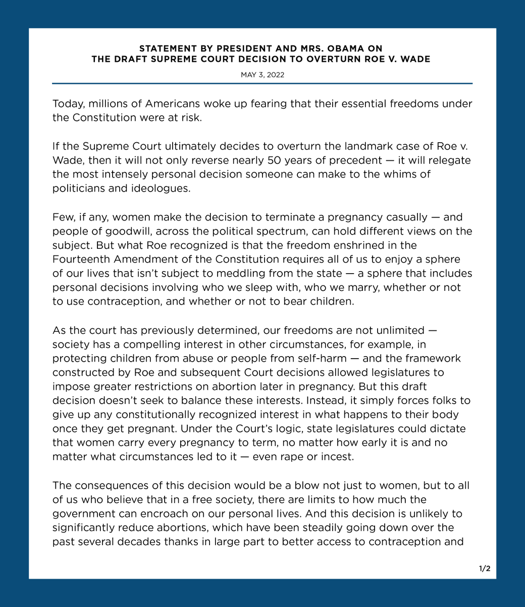
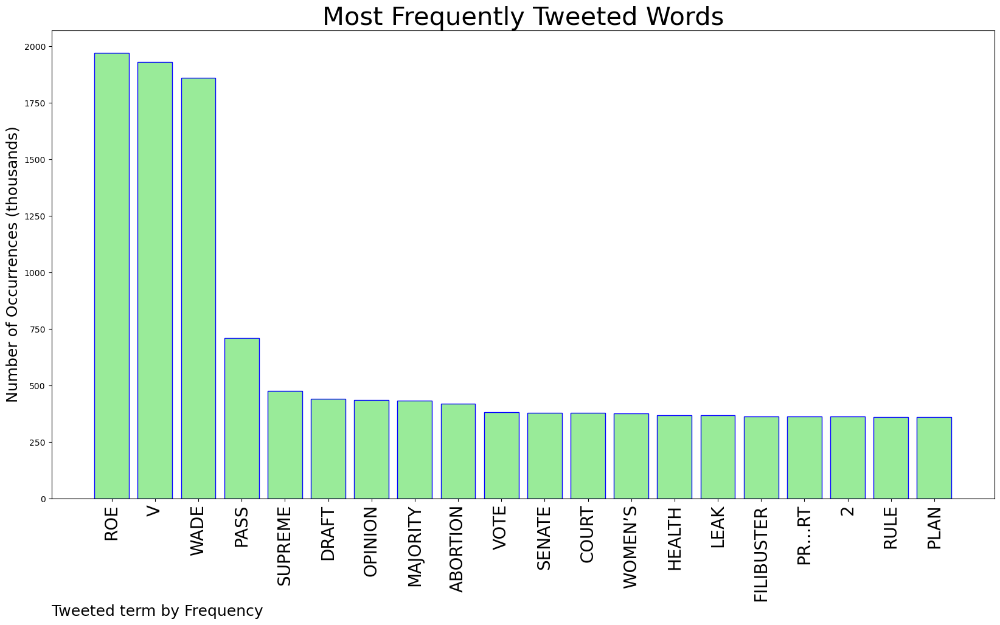
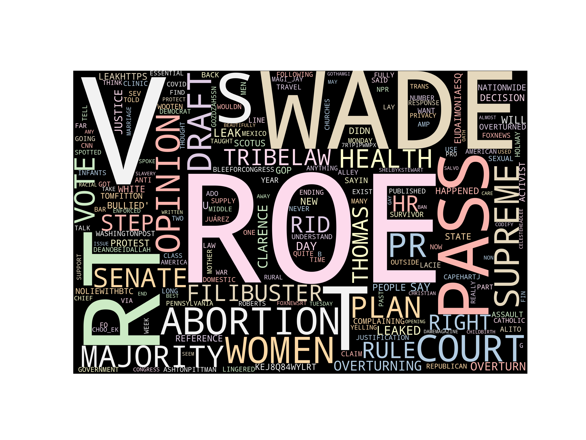
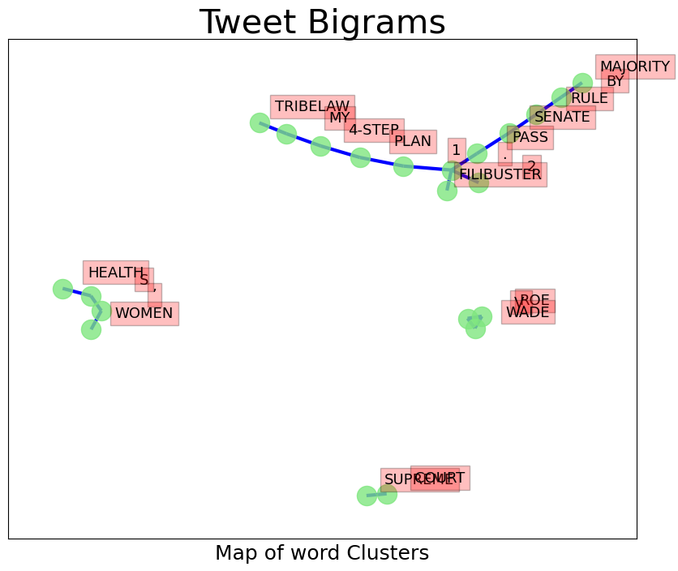
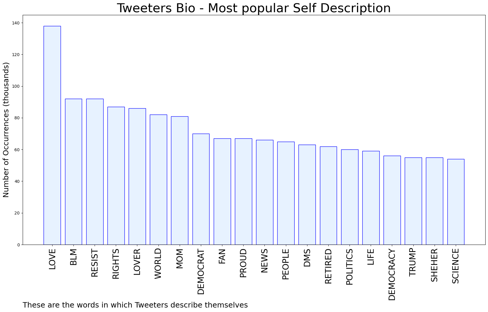
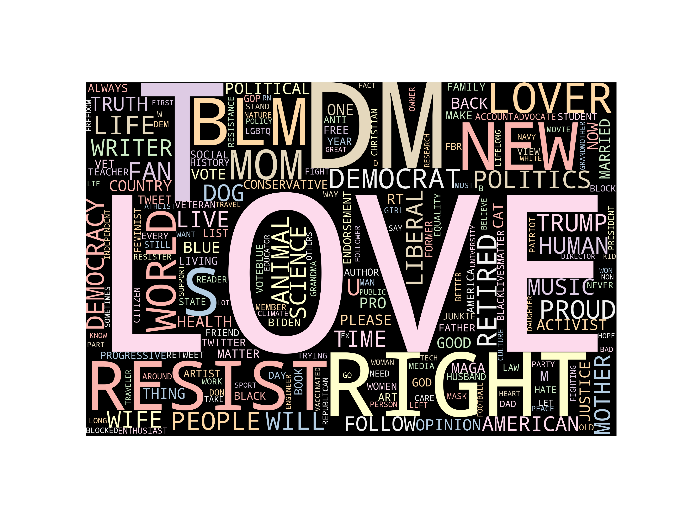
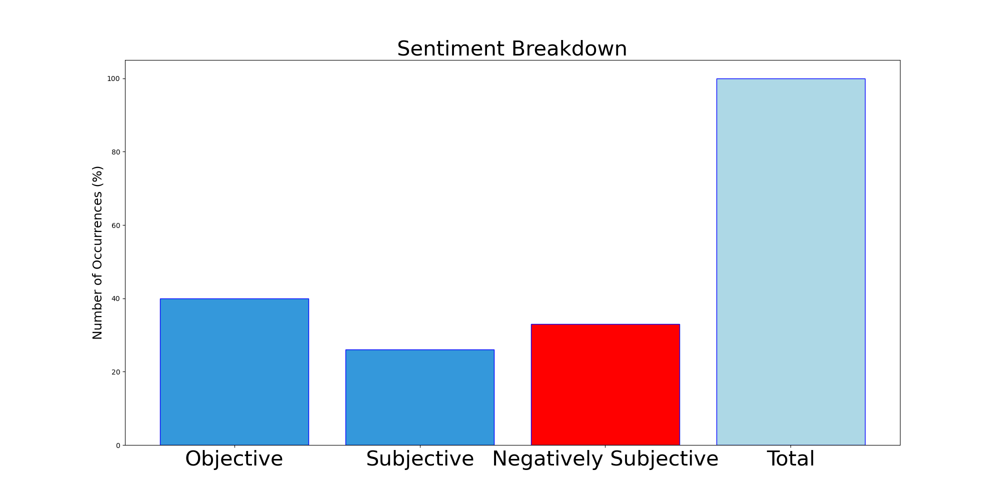

## AUTOMATED RESEARCH SUMMARY  

  

**Most trending image related to Ukraine**

  

<b> This report is AUTOMATED and not hand crafted, it is designed for pulling metrics on a given keyword or hashtag and performs a series of reporting and analysis.</b>

**Graph 1: most commonly tweeted words by Frequency**
  

**Img: TweetCloud**
  

### TRENDING SHARED IMAGE

  

    

 

### TWEET RELATIONSHIPS

  

    

 

|    **Sample-Tweets**        |
| :-------------: |
| RT @itsJeffTiedrich: pro tip: no furtive photo-op with Zelensky will make up for the fact that you Republican fucks though it was totally c… |
| The #AfricanUnion has remained more or less silent and, w/ out any sense of irony, has opted to hold the summit 202… https://t.co/v5FIG5frh2 |
| RT @amirkhId: Invasion of Ukraine should make us rethink how we approach this. You want to keep the great powers out, with what? Big words,… |  

  
The most popular user is: **LuckyngBigwin**
  

 RT @Atlanister: IamUkraine Studio Announces Groundbreaking Zelenskiy's NFT Collection Launch to Support Ukraine.

Discord :
https://t.co/XP… 

  
  

## RELATED METRICS  

    

| Metric | Value |
| ------------- | ------------- |
| `#1 Most tweeted to`  | **KyivIndependent** |
| `#2 Most tweeted to`  | **Eurovision** |
| `#3 Most tweeted to`  | **TimRunsHisMouth** |  
| NewProfiles (less than 10 days) | 0.87 %  |
| Tweeters with < 10 followers  | 7.4 %|
| Tweeters with > 1000000 followers  | 0.03 %  |  
  

## MOST POPULAR TWEET TERMS   

| Popularity Rank  | Term |
| ------------- | ------------- |
| first  | **UKRAINE**  |
| second  | **EUROVISION**  |
| third  | **HELP** |
| fourth  | **RUSSIA**  |
| fifth  | **MARIUPOL**  |  

  
  
## Twitter Bio Analysis  

**Graph 2: These are the words the tweeters use to describe themselves.**  
 

**Img: Bio Cloud**

    

### SENTIMENT ANALYSIS  
  

  

VIEWS WERE : **SUBJECTIVE**  (53.33%) & **NEGATIVELY-SUBJECTIVE** (0.0%) **OBJECTIVE** (46.67%)  

    

### TWEET SAMPLE  

| Random value picked from array |
| ------------- |
|RT @TimRunsHisMouth: More Democrats have visited Ukraine than our southern border. |

  

### MOST RETWEETED  

  

| The most retweeted user is: **LuckyngBigwin**  |
| ------------- |
| RT @Atlanister: IamUkraine Studio Announces Groundbreaking Zelenskiy's NFT Collection Launch to Support Ukraine.Discord :https://t.co/XP… |  

  

## Deeper Dive 

## Number of Top Words: 5 Number of Occurences: 3 

Sample  
Words: UKRAINE EUROVISION RUSSIA 🇺🇦 WIN 
     **RT @ALEXANDER_MAKA: IF UKRAINE 🇺🇦 WIN EUROVISION SONG CONTEST, THAT’S MEAN THE COMPETITION NEXT YEAR WILL TAKE PLACE IN RUSSIA 🇷🇺 🤦‍♂️🤣🤣🤣🤣🤣…**: ` Tweets ` 

## Number of Top Words: 4 Number of Occurences: 14 

Sample  
Words: UKRAINE HELP AZOVSTAL SAVE 
     **RT @HANNALIUBAKOVA: “SAVE MARIUPOL! SAVE AZOVSTAL NOW!” KALUSH ORCHESTRA ASKED TO HELP UKRAINE #EUROVISION HTTPS://T.CO/3RCBLDMZUP**: ` Tweets ` 

## Number of Top Words: 3 Number of Occurences: 66 

Sample  
Words: RUSSIA WAR US 
     **RT @UKRAINE66251776: US DEFENSE CHIEF LLOYD AUSTIN ADMITS HE SHUDDERS AT THE THOUGHT OF A WAR WITH NUCLEAR ARMED RUSSIA 
#UKRAINE #USA #BRI…**: ` Tweets ` 

## Number of Top Words: 2 Number of Occurences: 345 

Sample  
Words: AZOVSTAL SAVE 
     **RT @NIKAMELKOZEROVA: "SAVE MARIUPOL, SAVE AZOVSTAL RIGHT NOW," KALUSH ORCHESTRA SAID FROM THE STAGE. HE PROBABLY KNEW HE MIGHT BE DISQUALIF…**: ` Tweets ` 

## Number of Top Words: 1 Number of Occurences: 734 

Sample  
Words: ZELENSKY 
     **RT @LLOPISMARTA95: @EUROVISION VOLODYMYR ZELENSKY FOUND A FEW SECONDS TO SUPPORT #UKRAINIAN KALUSH #ORCHESTRA. #EUROVISION    

#UKRAINE 🇺🇦…**: ` Tweets ` 

  
     

    