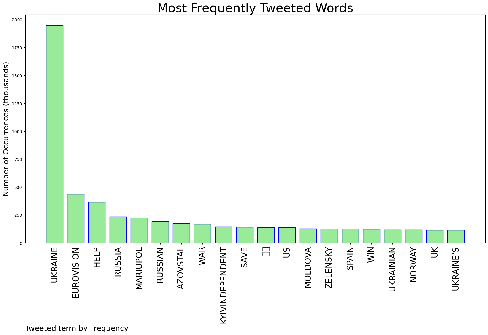

## AUTOMATED RESEARCH SUMMARY  

  

**Most trending image related to Roe v. Wade**

  

<b> This report is AUTOMATED and not hand crafted, it is designed for pulling metrics on a given keyword or hashtag and performs a series of reporting and analysis.</b>

**Graph 1: most commonly tweeted words by Frequency**
  

**Img: TweetCloud**
  

### TRENDING SHARED IMAGE

  

    

 

### TWEET RELATIONSHIPS

  

    

 

|    **Sample-Tweets**        |
| :-------------: |
| Says guy who refused to "live with the outcome" of Roe V. Wade. These zealots have no shame with their blatant hypo… https://t.co/8LlH0bM30Z |
| @j70728118_j @allincork @sirimahanthesh Assassinations of doctors, nurses, patients. Shooting, bombings outside hos… https://t.co/k9zdh7vTkX |
| Richard Spencer did more to protect Roe V Wade than most twitter leftists when he voted for Joe Biden. |  

  
The most popular user is: **cookie_lynch**
  

 RT @SenSanders: Congress must pass legislation that codifies Roe v. Wade as the law of the land in this country NOW. And if there aren’t 60… 

  
  

## RELATED METRICS  

    

| Metric | Value |
| ------------- | ------------- |
| `#1 Most tweeted to`  | **tribelaw** |
| `#2 Most tweeted to`  | **EudaimoniaEsq** |
| `#3 Most tweeted to`  | **NoLieWithBTC** |  
| NewProfiles (less than 10 days) | 1.37 %  |
| Tweeters with < 10 followers  | 4.33 %|
| Tweeters with > 1000000 followers  | 0.3 %  |  
  

## MOST POPULAR TWEET TERMS   

| Popularity Rank  | Term |
| ------------- | ------------- |
| first  | **ROE**  |
| second  | **V**  |
| third  | **WADE** |
| fourth  | **PASS**  |
| fifth  | **SUPREME**  |  

  
  
## Twitter Bio Analysis  

**Graph 2: These are the words the tweeters use to describe themselves.**  
 

**Img: Bio Cloud**

    

### SENTIMENT ANALYSIS  
  

  

VIEWS WERE : **SUBJECTIVE**  (26.67%) & **NEGATIVELY-SUBJECTIVE** (33.33%) **OBJECTIVE** (40.0%)  

    

### TWEET SAMPLE  

| Random value picked from array |
| ------------- |
|RT @ashtonpittman: If you haven't, take time to read my reporting on the long term strategy that Christian dominionists—who believe they ar… |

  

### MOST RETWEETED  

  

| The most retweeted user is: **cookie_lynch**  |
| ------------- |
| RT @SenSanders: Congress must pass legislation that codifies Roe v. Wade as the law of the land in this country NOW. And if there aren’t 60… |  

  

## Deeper Dive 

## Number of Top Words: 8 Number of Occurences: 1 

Sample  
Words: ROE V WADE SUPREME DRAFT OPINION COURT LEAK 
     **RT @LIFESAFEAST: I WHICH @SHANLONWU SMACKS DOWN TED CRUZ AND EXPLAINS WHY THE LEAK OF THE DRAFT SUPREME COURT OPINION ON ROE V WADE IS NOT…**: ` Tweets ` 

## Number of Top Words: 7 Number of Occurences: 5 

Sample  
Words: PASS MAJORITY VOTE SENATE WOMEN’S HEALTH RULE 
     **RT @TRIBELAW: MY 4-STEP PLAN:
1. PASS A SENATE RULE BY A MAJORITY VOTE TO GET RID OF THE FILIBUSTER.
2. PASS HR 3755, THE WOMEN’S HEALTH PR…**: ` Tweets ` 

## Number of Top Words: 6 Number of Occurences: 31 

Sample  
Words: ROE WADE SUPREME DRAFT OPINION COURT 
     **RT @FOXNEWS: CLARENCE THOMAS REFERENCES ROE V. WADE DRAFT OPINION LEAK, SAYS SUPREME COURT CAN'T BE 'BULLIED' HTTPS://T.CO/E3KYODX5PY**: ` Tweets ` 

## Number of Top Words: 5 Number of Occurences: 34 

Sample  
Words: ROE V WADE SUPREME OPINION 
     **RT @DEANOBEIDALLAH: PART OF GOP SUPREME COURT'S OPINION ENDING ROE V WADE USES THIS AS A JUSTIFICATION: "DOMESTIC SUPPLY OF INFANTS FOR ADO…**: ` Tweets ` 

## Number of Top Words: 4 Number of Occurences: 79 

Sample  
Words: ROE SUPREME SENATE COURT 
     **RT @MAYOISSPICYY: CAN WE TALK ABOUT HOW SUPREME COURT JUSTICES LIED UNDER OATH TO THE SENATE ABOUT ROE V. WADE?**: ` Tweets ` 

## Number of Top Words: 3 Number of Occurences: 236 

Sample  
Words: SUPREME DRAFT MAJORITY 
     **RT @NORAHODONNELL: EXCLUSIVE: IN @HILLARYCLINTON’S FIRST INTERVIEW SINCE THE MAJORITY DRAFT DECISION WAS LEAKED FROM THE SUPREME COURT, THE…**: ` Tweets ` 

## Number of Top Words: 2 Number of Occurences: 241 

Sample  
Words: ROE DRAFT 
     **RT @NOLIEWITHBTC: NEW: CLARENCE THOMAS IS COMPLAINING ABOUT THE NATIONWIDE PROTESTS AGAINST THE LEAKED DRAFT OVERTURNING ROE V. WADE, SAYIN…**: ` Tweets ` 

## Number of Top Words: 1 Number of Occurences: 158 

Sample  
Words: COURT 
     **IT'S NO WONDER HE RARELY SPEAKS DURING COURT APPEARANCES BECAUSE WHEN HE DOES, HE REVEALS JUST HOW FUCKING STUPID H… HTTPS://T.CO/UGG7OT1GPM**: ` Tweets ` 

  
     

    