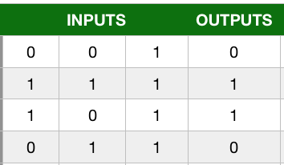
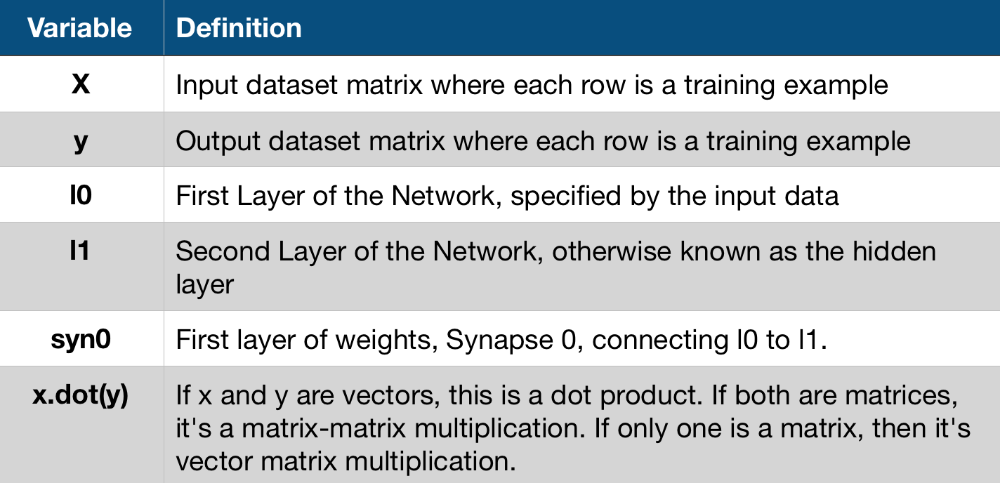
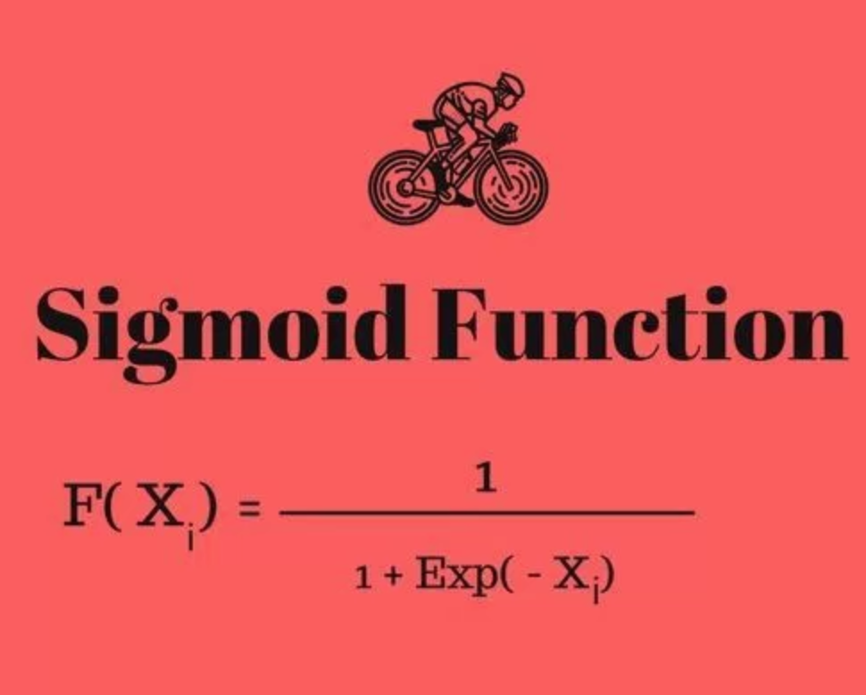
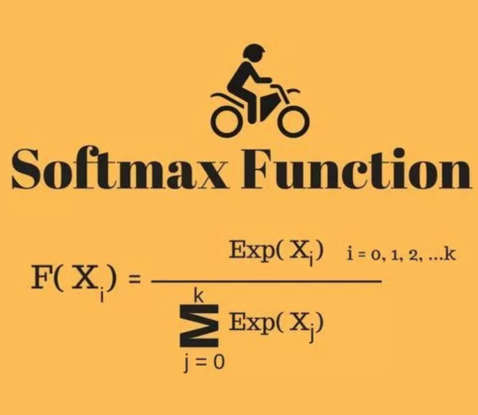

#                     <center>         BUILD YOUR OWN 2 & 3 LAYER AI NEURAL NETWORK  </center>

  
AI, Deep learning and Neural nets are all buzzwords these days and it can be quite intimidating given the rapid growth and interest in the area. I am going to solve this in two code dumps (one if you are in a hurry).


If you stick with me for the first code dump (30 lines) you will understand the core concept of how a Neural Network is used to build predictive models. If you are still around near halfway down the page for the second code dump (50 ~ lines) then you will see the hidden sauce which makes DeepLearning and Neural networks the hype they are today - backwards propogation. 

All the code here is in Python, I suggest you use an IDE like pycharm but if you are up for learning new things then Jupyter notebook is the way to go (it's what I wrote this blog in).

  


## NETWORK PRINCIPLE

The image shows a list of input/output relationships.

In the source code below, we are going to try and predict the output values by allowing the network to tune itself in the direction of the actual output so that the NN arives at the answer independently. What we have in the end is a tuned 'model'. 

Imagine you are trying to predict the output given the inputs, in this case there is a perfect correlation.  



Models are necessery for applications in real life, for example, if this was a fraud engine the model would give us a probability of fraud given certain input parameters. In this case, the outputs 1 would be fraud and 0 would be instances of no fraud. Of course this model would be far too simple, but the basic principles are the same.


# Lets build a 2 Layer Neural Network 
  
  
Lets go straight to the code, I will explain the key steps afterwards. This network performs forward propagation, basically there are two layers at each layer calculations are performed on nodes to steer in the direction of desired values. 


```python
import numpy as np


#SIGMOID FUNCTION 
def nonlin(x,deriv=False): # deriv is a trigger we set based upon the function boolean passed in 
    if(deriv==True):
        return x*(1-x)
    return 1/(1+np.exp(-x))

X = np.array([  [0,0,1],
                [1,1,1],
                [1,0,1],
                [0,1,1] ])


y = np.array([[0,1,1,0]]).T# TRANSPOSE IT  

# seed random numbers to make calculation
# deterministic (just a good practice)
np.random.seed(1)

syn0 = 2*np.random.random((3,1)) - 1    #synaptic weigths 


for iter in range(10000):
    
    
     #forward propagate 
    l0 = X
    l1 = nonlin(np.dot(l0,syn0))

    
    #how much did we miss by? 
    l1_error = y - l1
    
    
    
    # MULTIPLY THE AMOUNT WE MISSED BY THE
    # SLOPE OF THE SIGMOID AT THE VALUES IN L1
    l1_delta = l1_error * nonlin(l1,True)
    
    
    #update weights 
    syn0 += np.dot(l0.T,l1_delta)
    
    
print("training complete")
print(l1)
```

    training complete
    [[ 0.00966449]
     [ 0.99211957]
     [ 0.99358898]
     [ 0.00786506]]


# WAIT....what just happened?   

Note the actual outputs from the table above are:  

#### 0,1,1,0    

Our network got:  

#### 0.00966449, 0.99211957, 0.99358898,0.00786506.   
  
## We did it!  

If you round these numbers, you get 0,1,1,0 - basically our network has converged statistically to the correct answers. It will never reach 1 nor 0, but the distinction is so obvious that in practice there is no difference. 

# OK, WHAT ARE ALL THOSE VARIABLES ABOUT THEN? 

Below is a quick break down of some of the variables used,further down is a more definitive description of what just happened lol.



# BREAKING IT DOWN 

Some things to consider in our 30 lines of code that we ran, 
* Our network ran 10000 times
* Each time L1 got closer and closer to the predicted values (try printing l1 in the loop)
* The most important part is l1_delta = l1_error * nonlin(l1,True), this is slope of sigmoid more on this in another blog, but the bigger the slope the further away we are from the answer 
* This part (syn0 += np.dot(l0.T,l1_delta)) of the code is the actual end game, it is where we update our weights i.e. this is building our model. In the future if applied in a real life context, it would be the part that takes any input you give it and predict an output

  
## What's a sigmoid?  


### ^^ that's it (don't worry if you don't get it) 
Remember the bit in our code which said nonlin? It was a function, and does pretty much what the graph shows you above, it maps any of our numbers to a range between 0 and 1 i.e. 90 might be 0.87 and 12 might be 0.14. This allows us to convert numbers to probabilities.

Without going into to much detail, for our l1 we apply the sigmoid for probabilities but later we need to work out how much our error is (that is the slope of the graph). If you remember from calculus classes, to work out the slope you need to take the derrivative (hence how our funcion also can return the derivitive if we ask it to) and indeed we do when we work out the l1_delta


## Why seed random values? 

By seeding the numbers we get a random distribution, but each time round they are randomly distributed in the same way each time we train the network. This makes it easier for us to see how our changes impact on the network.

# SIGMOID VS SOFTMAX 
## SIGMOID FUNCTION


### Properties of Sigmoid Function

The sigmoid function returns a real-valued output.
The first derivative of the sigmoid function will be non-negative or non-positive.
Non-Negative: If a number is greater than or equal to zero.
Non-Positive: If a number is less than or equal to Zero.  

### Sigmoid Function Usage   

The Sigmoid function used for binary classification in logistic regression model.
While creating artificial neurons sigmoid function used as the activation function.
In statistics, the sigmoid function graphs are common as a cumulative distribution function.


## SOFTMAX FUNCTION



### Properties of Softmax Function  
   
The calculated probabilities will be in the range of 0 to 1.
The sum of all the probabilities is equals to 1.

### Softmax Function Usage
  
Used in multiple classification logistic regression model.
In building neural networks softmax functions used in different layer level.


# 3 LAYER NEURAL NET 
## WITH BACKPROPOGATION


```python
import numpy as np


#sigmoid function 


def nonlin(x, deriv=False):
    if(deriv==True):
        return x*(1-x)
    
    return 1/(1+np.exp(-x))
    


X = np.array([[0,0,1],
            [0,1,1],
            [1,0,1],
            [1,1,1]])


y = np.array([[0,1,1,0]]).T # TRANSPOSE IT  

# seed random numbers to make calculation
# deterministic (just a good practice)
np.random.seed(1)

#randomly initialize weights with a mean of 0 

syn0 =2*np.random.random((3,4)) - 1   # LAYER 0 WEIGHTS
syn1 =2*np.random.random((4,1)) - 1   # LAYER 1 WEIGHTS 


for j in range(60000):
    
    #feed forward thru layers  0,1 & 2
    l0 = X
    l1 = nonlin(np.dot(l0,syn0))
    l2 = nonlin(np.dot(l1,syn1))
    
    
    # LAYER 2 -----
    #HOW FAR DID WE OVERSHOOT/UNDERSHOOT TARGET 
    
    l2_error = y - l2 # actual output (y) minus l2 the last layer
    
    if (j% 10000) == 0:  # MODULUS i.e. divide j by 10000 and what is the remainder. Basically print 6 times
        print("Error:" + str(np.mean(np.abs(l2_error)))) 
        
    # IN WHAT DIRECTION IS THE TARGET (Y) VALUE
    # were we really sure? if so, don't change too much.
    l2_delta = l2_error * nonlin(l2, deriv=True)
    
    
    
    # LAYER 1 -------
    # how much did each l1 value contribute to the l2 error(according to the weights)?
    l1_error = l2_delta.dot(syn1.T) #confidence weighted error
    
    
    # IN WHAT DIRECTION IS THE TARGET L1 VALUE
    # were we really sure? if so, don't change too much.
    l1_delta = l1_error * nonlin(l1, deriv=True)
    
    

    
    
    syn1 += l1.T.dot(l2_delta)
    syn0 += l0.T.dot(l1_delta)
print(l2)
```

    Error:0.496410031903
    Error:0.00858452565325
    Error:0.00578945986251
    Error:0.00462917677677
    Error:0.00395876528027
    Error:0.00351012256786
    [[ 0.00260572]
     [ 0.99672209]
     [ 0.99701711]
     [ 0.00386759]]


"confidence weighted error" from l2 to establish an error for l1. To do this, it simply sends the error across the weights from l2 to l1. This gives what you could call a "contribution weighted error" because we learn how much each node value in l1 "contributed" to the error in l2. This step is called "backpropagating" and is the namesake of the algorithm. We then update syn0 using the same steps we did in the 2 layer implementation.


```python

```


    0


# COMPACT BACK PROPOGATION 


```python
import numpy as np
```


```python
X = np.array([ [0,0,1],[0,1,1],[1,0,1],[1,1,1] ])
X
```


    array([[0, 0, 1],
           [0, 1, 1],
           [1, 0, 1],
           [1, 1, 1]])


```python
y = np.array([[0,1,1,0]]).T # TRANSPOSE IT  
y
```


    array([[0],
           [1],
           [1],
           [0]])


```python
syn0 = 2*np.random.random((3,4)) - 1
syn1 = 2*np.random.random((4,1)) - 1


for j in range(60000):
    l1 = 1/(1+np.exp(-(np.dot(X,syn0))))
    l2 = 1/(1+np.exp(-(np.dot(l1,syn1))))
    l2_delta = (y - l2)*(l2*(1-l2))
    l1_delta = l2_delta.dot(syn1.T) * (l1 * (1-l1))
    syn1 += l1.T.dot(l2_delta)
    syn0 += X.T.dot(l1_delta)
    
```


```python
np.set_printoptions(suppress=True)
l2
```


    array([[ 0.00311247],
           [ 0.99617884],
           [ 0.99750128],
           [ 0.00405867]])


